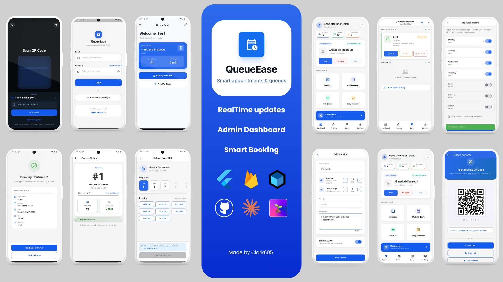

# Queue Ease

Smart queue and appointment management for small clinics and service-based businesses.


---

<p align="center">
   
</p>

## 📖 What the project does

Queue Ease helps businesses manage appointments and live queues while giving customers a real-time view of their position and estimated wait time. It supports separate admin and customer flows, enabling service setup, working hours, and queue operations for admins, while customers can book or join queues via a shareable link or QR code.

**Key Features:**
- 🔐 Role-based authentication (Admin & Customer)
- 📅 Appointment booking with conflict prevention
- 📊 Live queue management and real-time updates
- ⏱️ Automatic no-show detection with time margins
- 📱 QR code and unique link generation for easy access
- 🔔 Push notifications for queue status *(Sprint 7)*
- 📈 Daily summary and analytics *(post-MVP)*

For detailed product requirements, see [docs/domain/PRD.md](docs/domain/PRD.md).

---

## 🎓 Skills Learned

- ✅ Building multi-role Flutter apps (admin + customer)
- ✅ Implementing Clean Architecture in Flutter
- ✅ Real-time data flows with Firestore
- ✅ Firebase Auth integration (email/password, Google Sign-In)
- ✅ Advanced state management with flutter_bloc
- ✅ Dependency injection with GetIt + Injectable
- ✅ Role-based access control (RBAC) with GoRouter
- ✅ Structured error handling with Result types
- ✅ Comprehensive testing strategies
- ✅ Environment-based configuration (Dev/Prod flavors)

---

## 📁 Project Structure

```
lib/
├── core/                           # Shared infrastructure
│   ├── app/                        # Application setup (DI, routing)
│   ├── config/                     # Environment configuration
│   ├── error/                      # Error handling framework
│   ├── services/                   # Core services
│   ├── utils/                      # Utilities (logger, validators)
│   └── widgets/                    # Reusable UI components
│
├── features/
│   ├── shared_domain/              # Entities & Firestore models (all 5 complete)
│   ├── authentication/             # ✅ Complete
│   ├── onboarding/                 # ✅ Complete
│   ├── admin/
│   │   ├── organization_management/ # ✅ Complete
│   │   ├── service_management/      # ✅ Complete
│   │   ├── working_hours_management/# ✅ Complete
│   │   ├── queue_management/        # ✅ Complete
│   │   ├── share_access/            # ✅ Complete
│   │   ├── tutorial/                # ✅ Complete
│   │   ├── dashboard/               # ✅ Complete
│   │   └── daily_summary/           # ⏳ Pending
│   └── customer/
│       ├── booking/                 # ✅ Complete
│       ├── entry/                   # ✅ Complete
│       └── access_portal/           # ✅ Complete
│
├── firebase_options.dart
├── main_dev.dart
└── main_prod.dart

docs/
├── ARCHITECTURE.md
├── domain/PRD.md
├── domain/ENTITIES.md
├── FEATURE_CHECKLIST.md
├── PROJECT_TIMELINE.md
└── ADR/001-role-based-repositories.md
```

**Legend:** ✅ Complete | 🚧 In Progress | ⏳ Planned

**📋 Key Documents:**
- **[Constitution](.specify/memory/constitution.md)** — Core development principles and standards
- **[Architecture](docs/ARCHITECTURE.md)** — Technical implementation details
- **[PRD](docs/domain/PRD.md)** — Product requirements and MVP scope
- **[Entities](docs/domain/ENTITIES.md)** — Domain model specifications
- **[Feature Checklist](docs/FEATURE_CHECKLIST.md)** — Implementation progress tracker

---

## 🛠️ Technologies Used

### Core Framework
- **Flutter** 3.9.0+ — Cross-platform UI framework
- **Dart** 3.9.0+ — Programming language

### State Management & Architecture
- **flutter_bloc** 9.1.1 — State management (Cubit pattern)
- **Equatable** 2.0.7 — Value equality for domain entities

### Backend & Services
- **Firebase Core** 4.4.0
- **Firebase Auth** 6.1.4
- **Cloud Firestore** 6.1.2
- **Firebase Crashlytics** 5.0.7
- **Google Sign-In** 7.2.0

### Navigation & Routing
- **GoRouter** 17.1.0

### Dependency Injection
- **GetIt** 9.2.0 · **Injectable** 2.5.0

### Utilities
- **Intl** 0.20.2 · **UUID** 4.5.1 · **flutter_dotenv** 5.1.0

### Local Storage
- **SharedPreferences** 2.3.3

### UI Components
- **smooth_page_indicator** 2.0.1
- **qr_flutter** 4.1.0
- **share_plus** 12.0.1
- **gal** 2.3.0
- **mobile_scanner** (QR access portal)

### Logging & Debugging
- **Talker** 4.9.3 · **Talker Flutter** 4.9.3 · **Talker BLoC Logger** 4.9.3
- **Device Preview** 1.3.1 (dev only)

### Testing
- **flutter_test** · **bloc_test** 10.0.0 · **mocktail** 1.0.4

---

## 🎯 Current Project Status

**Last Updated:** May 31, 2026
**Current Branch:** `develop`

### ✅ Completed Sprints

| Sprint | Focus | Status |
|--------|-------|--------|
| Sprint 1 | Foundation: Auth, RBAC, Onboarding, Data models, Firestore rules | ✅ Complete |
| Sprint 2 | Admin Core: Org setup, Service management | ✅ Complete |
| Sprint 3 | Working Hours + QR/Share Access | ✅ Complete |
| Sprint 4 | Customer Booking Flow (end-to-end) | ✅ Complete |
| Sprint 5 | Queue System, Customer Dashboard, Access Portal | ✅ Complete |
| Sprint 6/7 | Business Automation: countdown, auto no-show, pre-booking lock | ✅ Complete |
| Sprint 009 | Bug fixes: 16 GitHub issues resolved (P1 + P2 + P3 implementations) | ✅ Complete |

### 🐛 Bug Fixes Shipped (Sprint 009)

**P1 — Critical**
- `#17` Firestore `whereIn` limit crash on 31+ queue entries — chunked to 30
- `#18` Cancelled appointments blocked re-booking of their slot
- `#19` Mixed-case QR slug lookup failed — normalized to lowercase

**P2 — High Impact**
- `#20` Slot picker didn't refresh when admin changed working hours mid-session
- `#21` `transactionNext` skipped ghost entries (completed/noShow) incorrectly
- `#22` Open/closed status derived from device clock instead of server time
- `#30` Wait-time countdown widget froze (no periodic rebuild)
- `#31` Cancellation blocked for `inQueue` appointments — now allowed
- `#32` Firestore rules rejected admin updates on cancelled appointments

**P3 — Medium**
- `#23` Retry after slot conflict re-submitted stale slot
- `#24` Multiple active appointments from different orgs were silently dropped
- `#25` Zero-duration services corrupted queue wait estimates
- `#26` Orphaned `inQueue` appointments from prior day not visible on dashboard
- `#27` Break-time end could be set before start with no inline error
- `#28` No booking horizon limit — now capped at 30 days
- `#29` Auto no-show backoff reset on any unrelated queue success

### 🚧 Deferred

- **Staff Member Management (Sprint 6A)** — Deferred to post-MVP. Single-queue model with staff filtering; spec and task breakdown complete in `specs/007-staff-management/`.

### ⏳ Next Up

| Sprint | Focus | Target |
|--------|-------|--------|
| Sprint 7 | FCM Push Notifications + UI/UX Polish | June 2026 |
| Sprint 8 | Comprehensive Testing + Production Deployment | July 2026 |

**Overall Progress:** ~82% complete
**Estimated MVP Timeline:** ~3-4 weeks remaining

---

## 🧪 Testing

### Run all tests:
```bash
flutter test
```

### Run specific test file:
```bash
flutter test test/shared/auth/auth_cubit_test.dart
```

### Run tests with coverage:
```bash
flutter test --coverage
```

### Current Test Coverage:
- ✅ Auth: AuthCubit (comprehensive)
- ✅ Core: Result type, AppException hierarchy
- ✅ Entities: Organization, Service, WorkingHours, Appointment, Queue
- ✅ Models: All 5 Firestore models with round-trip serialization
- ✅ Onboarding: Integration test
- ✅ Bug regression: P1/P2 issue fixes covered

**Total Test Files:** 20+

---

## 📚 Documentation

| Document | Description |
|----------|-------------|
| [ARCHITECTURE.md](docs/ARCHITECTURE.md) | Comprehensive technical architecture guide |
| [PRD.md](docs/domain/PRD.md) | Product requirements and specifications |
| [FEATURE_CHECKLIST.md](docs/FEATURE_CHECKLIST.md) | Feature implementation tracking |
| [PROJECT_TIMELINE.md](docs/PROJECT_TIMELINE.md) | Timeline, Gantt charts, milestones |
| [ENTITIES.md](docs/domain/ENTITIES.md) | Domain entity specifications |
| [ADR/001](docs/ADR/001-role-based-repositories.md) | Role-based repository architecture decision |

---

## 🔄 GitHub Workflow

```bash
# Feature branch from develop
git checkout -b feature/your-feature-name

# Commit
git commit -m "feat(scope): description"

# Push and open PR
git push origin feature/your-feature-name
```

**Branch Naming:** `feature/` · `bugfix/` · `refactor/` · `docs/`

---

## 🚀 Getting Started

### Prerequisites
- Flutter SDK 3.9.0+, Dart SDK 3.9.0+
- Android Studio / Xcode
- Firebase project (Auth, Firestore, Crashlytics)

### Installation

```bash
git clone https://github.com/Clark605/queue_ease.git
cd queue_ease
flutter pub get
flutter pub run build_runner build --delete-conflicting-outputs
cp .env.example .env.dev && cp .env.example .env.prod
# Add google-services.json / GoogleService-Info.plist
```

### Running

```bash
# Development
flutter run --flavor dev -t lib/main_dev.dart

# Production
flutter run --flavor prod -t lib/main_prod.dart
```

### Automation

The repository now keeps the local git hooks and CI checks in Dart for easier reuse.

```bash
# One-time developer setup
dart run tool/automation/setup_dev.dart

# Run the same validation that CI uses
dart run tool/automation/ci.dart

# Regenerate DI output manually
dart run tool/automation/run_build_runner.dart
```

What the hooks do:

- `pre-commit` runs `dart format --set-exit-if-changed .` and `flutter analyze` before every commit.
- `commit-msg` enforces Conventional Commits formatting for commit messages.
- If staged changes touch DI annotations or `lib/core/di/`, the hook runs build_runner and re-stages the generated output.
- `post-commit` deploys `firestore.rules` to the dev Firebase project automatically when a commit includes that file.

To install the hooks locally, run `dart run tool/automation/setup_dev.dart` once after cloning.