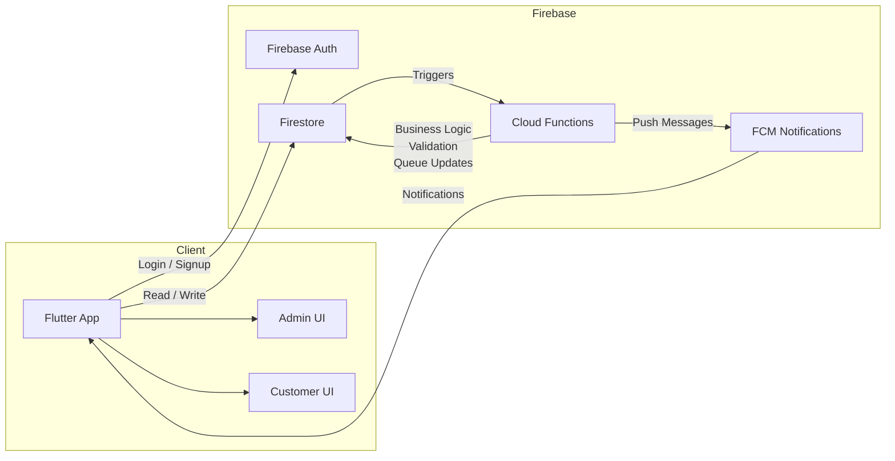

# Product Requirements Document (PRD)

## Product Name

Appointment & Queue Manager

## Product Vision

Provide small clinics and service-based businesses with a simple, reliable system to manage appointments and live queues, reduce waiting chaos, and improve customer experience without complex or expensive software.

---

## Problem Statement

Small clinics and service providers often rely on paper notebooks, WhatsApp messages, or verbal queues. This leads to:

* Double bookings and scheduling conflicts
* Long, uncertain waiting times for customers
* Poor communication when delays or no-shows happen
* No visibility into daily operations or performance

---

## Target Users

### 1. Business Admin (Clinic / Shop Owner)

* Manages services and working hours
* Controls daily appointments and queue
* Shares booking access with customers

### 2. Customer

* Accesses booking via QR code or unique link
* Books appointments or joins a queue
* Wants to know their position and wait time
* Expects timely notifications

---

## Goals & Success Metrics

### Goals

* Reduce appointment conflicts
* Make waiting time transparent
* Simplify daily operations for small businesses

### Success Metrics

* Appointment conflict rate < 1%
* Average queue wait uncertainty reduced
* Admin completes daily setup in < 2 minutes

---

## MVP Scope (Must-Have Features)

### 1. Authentication & Roles

* Login / signup
* Role-based access: Admin vs Customer

---

### 2. Service Management (Admin)

* Create services (name, duration)
* Define working hours

---

### 3. Appointment Booking (Customer)

* Access booking **via organization-specific QR code or unique link**
* View organization landing screen (services, hours, status)
* Select service
* Choose available time slot
* Prevent double booking

**Rules:**

* No booking outside working hours
* No overlapping appointments

---

### 4. Daily Queue Management (Core Feature)

* Auto-generate daily queue from appointments
* Admin actions:

  * Mark next customer
  * Skip / mark no-show
  * Reorder queue
* Customer view:

  * Current position
  * Estimated waiting time

**Time Margin Policy (Important):**

* Each service has a configurable *time margin* (e.g., 5–10 minutes)
* When a customer's turn starts, a countdown begins
* If the customer does not check in within the margin:

  * Appointment status automatically changes to `no_show`
  * Queue advances to the next customer
* Margin logic is enforced server-side to avoid manipulation

### 5. Real-Time Updates

* Queue updates propagate instantly
* Customer view updates automatically

---

### 6. Notifications

* Notify customer when:

  * Their turn is approaching
  * Appointment is delayed
  * They missed their turn

---

## Out of Scope (Not in MVP)

* Online payments
* Multi-branch support
* Video calls
* Advanced analytics dashboards

---

## User Flows

### Customer Flow 

1. Scan QR code or open unique booking link
2. View organization landing screen
3. Select service
4. Book appointment or join queue
5. View queue position
6. Receive notifications

### Admin Flow

1. Login
2. Set services and hours
3. View today's queue
4. Manage queue in real time
5. End day

---

## Screen-by-Screen Navigation Map

```mermaid
flowchart TD
  A[Splash Screen] --> B[Login / Signup]

  B -->|Admin| D[Admin Dashboard]
  B -->|Customer via QR/Link| C0[Organization Landing]

  %% Customer Screens
  C0 --> C1[Select Service]
  C1 --> C1a[Service Details]
  C1a --> C2[Select Time Slot]
  C2 --> C3[Booking / Queue Join]
  C3 --> C4[Booking Confirmation]
  C4 --> C5[Queue Status]

  %% Admin Screens
  D --> D1[Service Management]
  D --> D2[Working Hours Setup]
  D --> D3[Today's Queue]
  D3 --> D4[Queue Actions]
  D --> D5[Share QR / Booking Link]
  D --> D6[Daily Summary (Basic)]
```

### Screen Responsibilities

**Splash Screen**

* App initialization
* Check authentication state

**Login / Signup**

* Authenticate user
* Determine role (Admin / Customer)

**Organization Landing Screen**

* Display business name and logo
* Show open/closed status
* List available services
* Entry point for booking

**Select Service**

* Display available services
* Show duration

**Select Time Slot**

* Show available slots
* Prevent conflicts

**Service Details Screen**

* Service description and duration
* Time margin / grace period explanation
* Continue CTA

**Booking / Queue Join Screen**

* Minimal customer input (name, phone optional)
* Selected service summary
* Booking type confirmation

**Booking Confirmation**

* Booking ID / queue number
* Organization details and instructions
* Track status CTA

**Queue Status**

* Current position
* Estimated wait time
* Live updates

**Admin Dashboard**

* Entry point for admin
* Navigation to management features

**Service Management**

* Add / edit services

**Working Hours Setup**

* Configure daily schedule

**Today's Queue**

* Real-time queue view
* Active appointment highlight

**Queue Actions**

* Mark next
* Skip customer
* Mark no-show

**Daily Summary (Basic)**

* Appointments count
* No-shows
* Average wait time

---

## Data Model (High-Level)

### Users

* id
* role (admin / customer)

### Services

* id
* name
* duration

### Appointments

* id
* userId
* serviceId
* time
* status (booked | in_queue | done | no_show)

### Queues

* date
* orderedAppointmentIds

---

## Technical Stack (Proposed)

* Frontend: Flutter
* State Management: Riverpod or BLoC
* Backend: Firebase (Auth, Firestore)
* Server Logic: Cloud Functions
* Notifications: Firebase Cloud Messaging

---

## System Design (High-Level)



### Component Responsibilities

**Flutter App**

* Presentation layer (UI)
* State management (queue state, booking state)
* Real-time listeners to Firestore

**Firebase Auth**

* User authentication
* Role identification (Admin / Customer)

**Firestore**

* Store users, services, appointments, queues
* Provide real-time updates to clients

**Cloud Functions**

* Prevent booking conflicts
* Maintain queue consistency
* Trigger notifications

**FCM**

* Notify customers about queue changes
* Alert for delays or missed turns

---

---

## Non-Functional Requirements

* Real-time consistency
* Low latency updates
* Basic offline support
* Secure access via Firestore rules

---

## MVP Timeline (Suggested)

* Week 1: Auth, roles, services, data model
* Week 2: Appointment booking + conflict logic
* Week 3: Queue system + real-time updates
* Week 4: Notifications, polish, testing, deployment

---

## Risks & Mitigations

* **Race conditions in queue updates** → Use server-side validation
* **Over-scoping MVP** → Strictly follow MVP feature list

---

## Definition of Done (MVP)

* Admin can manage a full day without manual tools
* Customers always know their queue position
* System handles delays and no-shows correctly
* App is stable, deployable, and demo-ready

---

## Screens Breakdown & Responsibilities

### Customer-Facing Screens

#### 1. Organization Landing Screen (Entry via QR / Link)

**Purpose:** First touchpoint for customers after scanning QR or opening shared link. **Contains:**

* Organization name, logo, short description
* Branch/location info (optional)
* List of available services
* Service duration & price (if applicable)
* CTA: "Book Appointment" / "Join Queue"

#### 2. Service Details Screen

**Purpose:** Allow customer to understand service before booking. **Contains:**

* Service name & description
* Estimated service duration
* Time margin / grace period explanation
* Available booking type (appointment / walk-in queue)
* CTA: "Continue"

#### 3. Booking / Queue Join Screen

**Purpose:** Collect minimal customer input. **Contains:**

* Customer name
* Phone number (optional)
* Selected service summary
* Booking type confirmation
* CTA: "Confirm"

#### 4. Queue Status Screen

**Purpose:** Show real-time queue state. **Contains:**

* Current queue number
* Estimated waiting time
* Current serving number
* Status badges (Waiting / Almost Turn / No-show)
* Auto-refresh indicator

#### 5. Booking Confirmation / Success Screen

**Purpose:** Confirm successful booking. **Contains:**

* Booking ID / Queue number
* Organization details
* Instructions (arrive before margin time)
* CTA: "Track Status"

---

### Admin-Facing Screens

#### 1. Admin Authentication Screen

**Purpose:** Secure access for organization staff. **Contains:**

* Email / password login
* Organization selector (if multiple)

#### 2. Dashboard / Live Queue Screen

**Purpose:** Central control panel. **Contains:**

* Current serving customer
* Upcoming queue list
* Queue statuses (Waiting / Serving / No-show / Completed)
* Action buttons: Next, Mark No-show, Complete

#### 3. Services Management Screen

**Purpose:** Configure services. **Contains:**

* Service list
* Add / edit service
* Duration per service
* Time margin configuration

#### 4. QR Code & Booking Link Screen

**Purpose:** Customer acquisition. **Contains:**

* Generated QR code
* Unique booking URL
* Share / download options

#### 5. Daily Summary (Basic)

**Purpose:** End-of-day snapshot (MVP-safe). **Contains:**

* Daily served customers
* Average waiting time
* No-show rate

---

### Post-MVP Screens (Design Only)

#### 1. Queue History & Analytics Screen

**Purpose:** Deeper operational insights (post-MVP). **Contains:**

* Service popularity
* Trend charts
* Advanced analytics

#### 2. Settings Screen

**Purpose:** Organization configuration (post-MVP). **Contains:**

* Organization info
* Working hours
* Queue behavior rules
* Notification preferences

#### 3. Onboarding Screens

**Purpose:** Brief product walkthrough and value framing (post-MVP). **Contains:**

* 2-3 slides highlighting benefits
* Skip option
