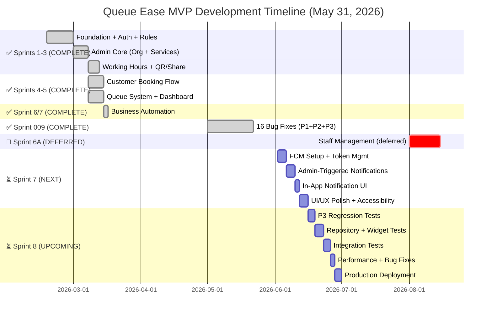
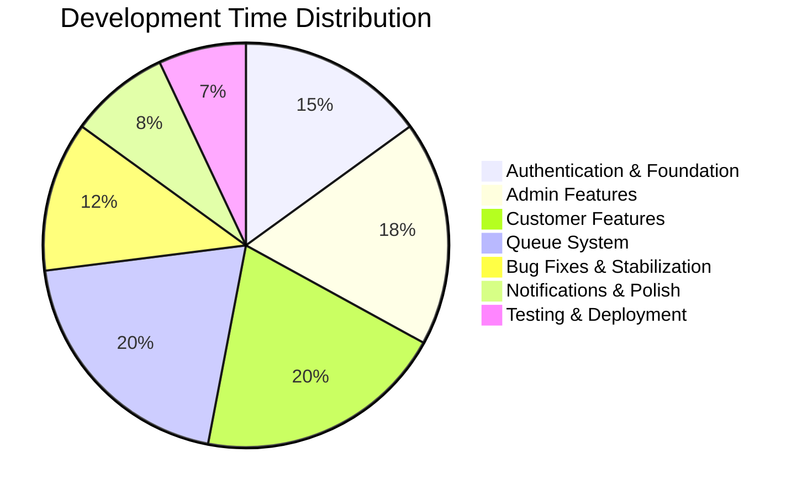

# Queue Ease - Project Timeline & Network Diagrams

**Last Updated:** May 31, 2026
**Project:** Appointment & Queue Manager (Queue Ease)
**Timeline:** ~3-4 Weeks Remaining (MVP)
**Current Status:** ✅ Sprints 1–6/7 + Sprint 009 (Bug Fixes) complete; 🔄 Sprint 6A (Staff Management) deferred to post-MVP; ⏳ Sprint 7 (Notifications & Polish) is the active next sprint
**Development Approach:** Agile Incremental (Repo + Feature per Sprint)

---

## 📊 Current Progress Summary

### ✅ COMPLETED (through May 31, 2026)

| Sprint | Deliverables | Date |
|--------|-------------|------|
| **Sprint 1** | Auth (email/password, Google), RBAC, onboarding, data models (5 entities + 5 models), Firestore rules (78 tests) | Feb 2026 |
| **Sprint 2** | Organization setup (atomic create on signup), service management CRUD, first-time tutorial | Mar 8, 2026 |
| **Sprint 3** | Working hours config (7-day, break times, batch save), QR/share access (qr_flutter, share_plus, gal) | Mar 10, 2026 |
| **Sprint 4** | Customer booking flow end-to-end (org landing → service → slot picker → booking form → confirmation) | Mar 15, 2026 |
| **Sprint 5** | Queue system (generation, admin actions, customer status), customer dashboard, access portal (QR + URL) | Mar 15, 2026 |
| **Sprint 6/7** | Business automation: countdown timer, pre-booking lock, auto no-show progression, rejoin refresh | Mar 16, 2026 |
| **Sprint 009** | 16 GitHub issues resolved — P1 (3), P2 (6), P3 (7) — with regression tests for P1/P2 | May 2026 |

### 🔄 DEFERRED
- **Sprint 6A — Staff Member Management**: Spec and task breakdown complete (`specs/007-staff-management/`). Deferred to post-MVP. Single-queue + staff-filter hybrid model ready for implementation when prioritized.

### ⏳ UPCOMING

| Sprint | Focus | Target |
|--------|-------|--------|
| **Sprint 7** | FCM notifications + UI/UX polish | June 2026 |
| **Sprint 8** | Testing + deployment | July 2026 |

---

## 📅 Updated Gantt Chart

```mermaid
gantt
    title Queue Ease MVP Development Timeline (May 31, 2026)
    dateFormat YYYY-MM-DD

    section ✅ Sprints 1-3 (COMPLETE)
    Foundation + Auth + Rules     :done, s1, 2026-02-17, 12d
    Admin Core (Org + Services)   :done, s2, 2026-03-01, 7d
    Working Hours + QR/Share      :done, s3, 2026-03-08, 5d

    section ✅ Sprints 4-5 (COMPLETE)
    Customer Booking Flow         :done, s4, 2026-03-08, 7d
    Queue System + Dashboard      :done, s5, 2026-03-08, 7d

    section ✅ Sprint 6/7 (COMPLETE)
    Business Automation           :done, s67, 2026-03-15, 2d

    section ✅ Sprint 009 (COMPLETE)
    16 Bug Fixes (P1+P2+P3)       :done, s009, 2026-05-01, 21d

    section 🔄 Sprint 6A (DEFERRED)
    Staff Management (deferred)   :crit, s6a, 2026-08-01, 14d

    section ⏳ Sprint 7 (NEXT)
    FCM Setup + Token Mgmt        :s7a, 2026-06-02, 4d
    Admin-Triggered Notifications :s7b, 2026-06-06, 4d
    In-App Notification UI        :s7c, 2026-06-10, 2d
    UI/UX Polish + Accessibility  :s7d, 2026-06-12, 4d

    section ⏳ Sprint 8 (UPCOMING)
    P3 Regression Tests           :s8a, 2026-06-16, 3d
    Repository + Widget Tests     :s8b, 2026-06-19, 4d
    Integration Tests             :s8c, 2026-06-23, 3d
    Performance + Bug Fixes       :s8d, 2026-06-26, 2d
    Production Deployment         :s8e, 2026-06-28, 3d
```

---

## 🐛 Sprint 009 — Bug Fix Summary (Complete)

All 16 open GitHub issues were triaged, fixed, and validated with regression tests.

### P1 — Critical Blockers ✅

| Issue | Title | Root Cause | Fix Location |
|-------|-------|-----------|--------------|
| `#17` | Firestore `whereIn` limit crash (31+ entries) | No chunking on `whereIn` queries | `admin_queue_repository_impl.dart` — `_chunks()` helper |
| `#18` | Cancelled appointments block re-booking | `cancelled` not excluded from taken slots | `calculate_available_slots_use_case.dart` |
| `#19` | Mixed-case QR slug lookup fails | Slug not lowercased before Firestore query | `parse_access_url_use_case.dart` |

### P2 — High Impact ✅

| Issue | Title | Fix |
|-------|-------|-----|
| `#20` | Slot picker doesn't refresh on working-hours change | `SlotPickerCubit` now re-triggers on stream emit |
| `#21` | `transactionNext` shows ghost current entry | Scan forward to next `inQueue` entry |
| `#22` | Open/closed uses device clock | `OrganizationLandingCubit` uses server-normalized time |
| `#30` | Wait-time countdown freezes | `WaitTimerCountdown` periodic rebuild restored |
| `#31` | `inQueue` appointments can't be cancelled | `CancelAppointmentUseCase` allows `booked` + `inQueue` |
| `#32` | Firestore rules reject admin update on cancelled appt | `cancelled` whitelisted in rules |

### P3 — Medium ✅ (implementations), ⏳ (tests pending Sprint 8)

| Issue | Title | Fix |
|-------|-------|-----|
| `#23` | Retry re-submits stale slot | `BookingFormCubit` separates retryable vs conflict errors |
| `#24` | Multiple active appointments silently dropped | `WatchCustomerDashboardUseCase` logs all, keeps first |
| `#25` | Zero-duration service corrupts wait estimates | 5-minute fallback in repository + Firestore rules |
| `#26` | Orphaned `inQueue` appts from prior day hidden | Secondary query merges past active appointments |
| `#27` | Break end < break start has no inline error | `BreakTimeSection` shows error immediately |
| `#28` | No booking horizon limit | 30-day cap in `CreateBookingUseCase` + Firestore rules |
| `#29` | Auto no-show backoff resets on unrelated success | Backoff keyed per `appointmentId` in `QueueManagementCubit` |

---

## 🚀 Sprint Plans (Remaining)

### Sprint 7 — Notifications & Polish (Weeks 1-2 of June)

**Goal**: FCM push notifications fully working + UI/UX polish pass

**Backlog**:
- FCM setup in Firebase Console; `firebase_messaging` package added
- FCM token registration on app launch; tokens stored in `users/{uid}/fcm_tokens`
- Admin-triggered notifications when queue status changes:
  - "Turn approaching" (2-3 customers ahead)
  - "It's your turn" (status → serving)
  - "Missed your turn" (status → noShow)
- In-app notification UI (banner / notification list)
- Push notification handling: foreground, background, terminated
- UI/UX: accessibility audit, contrast check, tap target review
- Final responsive layout pass (small phone, large phone, tablet)

**Definition of Done**:
- [ ] FCM token stored per user in Firestore
- [ ] Admin queue action sends FCM to affected customer
- [ ] Push received in all three app lifecycle states
- [ ] UI polished and consistent across all screens
- [ ] `flutter analyze` clean

---

### Sprint 8 — Testing & Deployment (Weeks 3-4 of June / Early July)

**Goal**: Comprehensive test coverage, production deployment, MVP done

**Backlog**:
- P3 regression test files (T026–T038 from `specs/009-resolve-github-issues/tasks.md`)
- Repository unit tests: `AdminServiceRepository`, `CustomerAppointmentRepository`, queue repository
- Widget tests: `ServiceFormPage`, `WorkingHoursPage`, `QueueManagementPage`
- Integration tests: full booking flow, full queue flow
- Performance profiling with Flutter DevTools
- Production build validation (APK/AAB)
- Firebase App Distribution internal release
- User and admin guide documentation
- Final `flutter test --coverage` report

**Definition of Done**:
- [ ] Unit test coverage ≥ 80% for domain + data layers
- [ ] All critical user flows covered by integration test
- [ ] Release build passes on physical device
- [ ] App distributed via Firebase App Distribution
- [ ] MVP demo-ready

---

### Post-MVP — Staff Management (Sprint 6A)

Full spec at `specs/007-staff-management/` (57 tasks, quickstart, contracts).

**Phases**:
1. StaffMemberEntity + Model + Repository
2. Service/Appointment breaking changes (add `staffId`)
3. Staff Management UI (CRUD)
4. Service form staff dropdown
5. Appointment staff inheritance
6. Queue UI staff column + filter
7. Firestore rules for staff subcollection

**Estimated effort**: 6-7 days (1 developer)

---

## 📈 Resource Allocation

```mermaid
pie title Development Time Distribution
    "Authentication & Foundation" : 15
    "Admin Features" : 18
    "Customer Features" : 20
    "Queue System" : 20
    "Bug Fixes & Stabilization" : 12
    "Notifications & Polish" : 8
    "Testing & Deployment" : 7
```

---

## ⚠️ Risk Register

| Risk | Impact | Probability | Mitigation |
|------|--------|-------------|------------|
| FCM delivery failures on terminated state | Medium | Medium | Test across Android/iOS, implement retry |
| P3 test coverage reveals new regressions | Medium | Low | Fix-forward before deployment freeze |
| Staff management scope creep post-MVP | High | Medium | Strict spec boundary in `specs/007-staff-management/spec.md` |
| iOS build configuration complexity | Medium | Medium | Start early in Sprint 8 |

---

## 🎯 Milestone Checklist

- [x] **M1**: Authentication complete
- [x] **M2**: Data models + Firestore rules (78 tests, deployed)
- [x] **M3**: Admin can manage org, services, working hours
- [x] **M4**: Admin can share organization via QR/link
- [x] **M5**: Customers can book appointments (end-to-end)
- [x] **M6**: Queue system operational with real-time updates
- [x] **M7**: Time margin and automation working (client-side)
- [x] **M8**: All known bugs (16 issues) fixed and regression-tested
- [ ] **M9**: FCM push notifications functional ← **NEXT**
- [ ] **M10**: MVP fully tested and deployed to internal testing

---

## 📊 Overall Progress (May 31, 2026)

| Area | Status | % |
|------|--------|---|
| Authentication + Auth UI | ✅ | 100% |
| Onboarding | ✅ | 100% |
| Admin org, services, working hours | ✅ | 100% |
| Admin queue management + automation | ✅ | 100% |
| Customer booking flow | ✅ | 100% |
| Customer queue status + dashboard | ✅ | 100% |
| Access portal (QR + URL) | ✅ | 100% |
| Bug fixes (16 issues) | ✅ | 100% |
| Notifications (FCM) | ⏳ | 0% |
| Staff management | 🔄 | 0% (deferred) |
| Daily summary | ⏳ | 5% (shell only) |
| Comprehensive testing | ⏳ | 40% |
| Production deployment | ⏳ | 0% |
| **Overall MVP** | **~82%** | |

---

**For Updates:**
- [Feature Checklist](FEATURE_CHECKLIST.md)
- [PRD](domain/PRD.md)
- [Architecture](ARCHITECTURE.md)