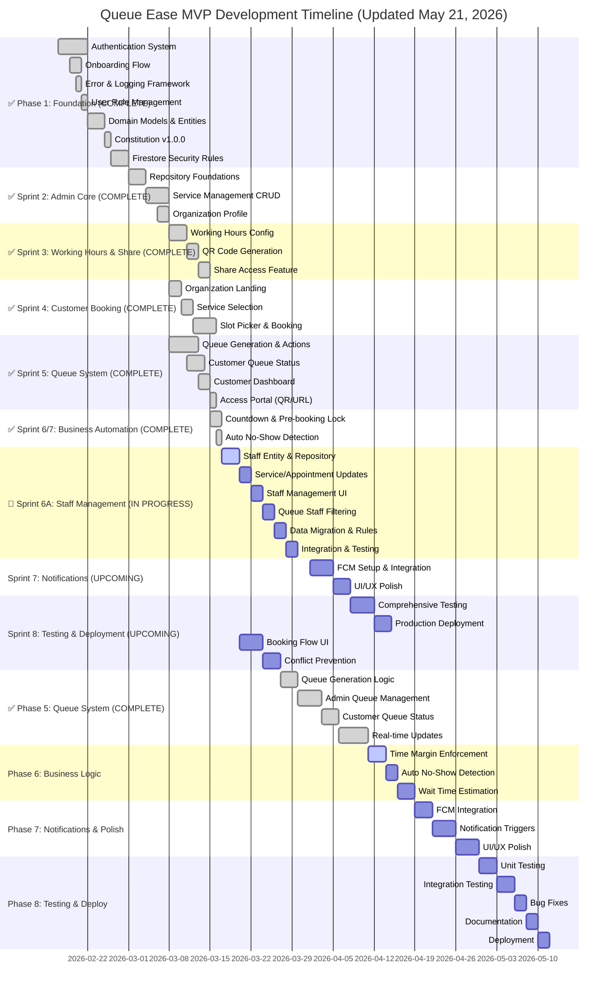
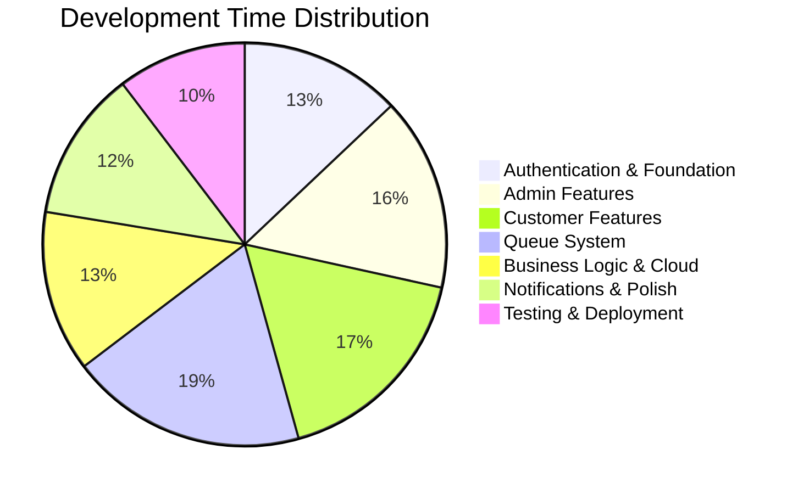

# Queue Ease - Project Timeline & Network Diagrams

**Last Updated:** May 21, 2026
**Project:** Appointment & Queue Manager (Queue Ease)
**Timeline:** ~4-6 Weeks Remaining (MVP)
**Current Status:** ✅ Phase 1 through Sprint 6 complete; 🚧 Sprint 6A (Staff Member Management) in progress; ✅ Sprint 7 prep checkpoint merged; ⏳ Sprint 7 (Notifications & Polish) implementation next
**Development Approach:** Agile Incremental (Repo + Feature per Sprint)

---

## 📊 Current Progress Summary

**✅ COMPLETED (through May 21, 2026)**
- **Phase 1: Foundation** - COMPLETE
  - ✅ Authentication System (email/password, Google Sign-In, password reset)
  - ✅ User Role Management (RBAC with router integration)
  - ✅ Error Handling Framework (Result type, AppException hierarchy)
  - ✅ Logging Infrastructure (AppLogger with Talker)
  - ✅ Onboarding Flow (complete with custom illustrations)
  - ✅ Basic Dashboard Pages (Admin & Customer)
  - ✅ Firebase Crashlytics integration with Talker
  - ✅ Flavor configuration (dev/prod environments with dotenv)
- **Data Models** - COMPLETE
  - ✅ All 5 core domain entities (Organization, Service, WorkingHours, Appointment, Queue)
  - ✅ All 5 Firestore models with Firestore serialization (fromFirestore, toFirestore)
  - ✅ 15+ unit tests for entities and models
  - ✅ Constitution v1.0.0 ratified with development standards
- **Firestore Security Rules** - COMPLETE
  - ✅ Comprehensive RBAC security rules (345 lines) covering all 6 collections
  - ✅ 78 TypeScript tests passing (users, organizations, services, working_hours, appointments, queues)
  - ✅ Deployed to both dev & prod Firebase environments
  - ✅ Data validation, field immutability, and cross-org access prevention
- **Sprint 2: Admin Core** - COMPLETE
  - ✅ Organization creation during admin signup
  - ✅ OrganizationRepository with real-time streams
  - ✅ Organization profile view and edit screens
  - ✅ ServiceRepository with CRUD operations
  - ✅ Service management UI (list, add, edit, delete)
  - ✅ Service validation and time margin configuration
  - ✅ First-time setup tutorial for new admins
  - ✅ User document updated with organizationId reference

**✅ SPRINT 3 COMPLETE (March 10, 2026)**
- ✅ Working Hours Configuration (repository → UI)
- ✅ QR Code Generation & Share Access (repository → UI)
- ✅ Break Time Configuration
- ✅ Firestore security rules updated for break fields
- ✅ Platform permissions (Android & iOS) for gallery access
- ✅ Native share integration

**✅ SPRINT 4 COMPLETE (March 15, 2026)**
- ✅ Firestore appointment rules + compound index deployed (T002–T003)
- ✅ AppointmentRepository domain interface (T004) + AppointmentModel.fromEntity (T005)
- ✅ Organization landing page — slug lookup, open/closed badge, Book CTA (T006–T013)
- ✅ Service selection page — real-time active services list, ServiceCard widget (T014–T019)
- ✅ Service details page — stats grid (duration, price, queueType) + "Continue to Booking" (T019a–T019b)
- ✅ Slot picker — DateSelector, TimeSlotGrid, CalculateAvailableSlotsUseCase, conflict-aware (T020–T028)
- ✅ Booking form — BookingSummaryCard, name/phone fields, transactional write, inline retry (T029–T034)
- ✅ Booking confirmation screen — org/service/time/address display, Back to Home (T035–T036)
- ✅ Phase 8 Polish complete: build_runner regeneration, Talker audit, auth-redirect verification, smoke test

**✅ SPRINT 5 COMPLETE (March 15, 2026)**
- ✅ Admin queue progression flow (next, skip, no-show, rejoin)
- ✅ Queue generation from daily booked appointments with idempotent behavior
- ✅ Customer live queue status stream with privacy-safe data
- ✅ Wait-time estimation integrated into admin/customer queue views
- ✅ Customer dashboard home (active queue card, upcoming appointment card, explicit empty states)
- ✅ Customer access portal (camera QR, gallery QR, manual URL entry)
- ✅ Queue logging and user-facing error messaging alignment across queue cubits
- ✅ DI and routing updates for dashboard, queue status, and access portal
- ✅ Customer appointment watching flow (appointments list, watch use case, cancel action)
- ✅ Customer dashboard UI refinements and supporting components

**✅ SPRINT 6/7 COMPLETE (March 16, 2026)**
- ✅ Time margin countdown for current customer (booking-time based)
- ✅ Pre-booking action lock ("Not due yet" state)
- ✅ Auto no-show detection on queue mount and countdown expiry
- ✅ Explicit start-serving action with queue generation refactor
- ✅ Customer no-show status messaging (real-time updates)
- ✅ Rejoin remains reversible after automation
- ✅ Firestore rules updated for serving-first lifecycle

**🚧 IN PROGRESS (Sprint 6A - March 17-29, 2026)**
- Staff Member Management (Hybrid Approach — Critical for MVP)
  - StaffMemberEntity and CRUD operations
  - ServiceEntity breaking change (add staffId/staffName)
  - AppointmentEntity breaking change (add staffId/staffName)
  - Staff management UI (list, create, edit, delete)
  - Service-to-staff assignment validation
  - Queue UI staff filtering and display
  - Customer booking with transparent staff inheritance
  - Data migration script for existing services/appointments
  - Firestore security rules for staff subcollection

**⏳ PENDING (Agile Incremental Approach)**
- Sprint 7 (Weeks 12-13, April 2026): Notifications & Polish
  - FCM push notifications setup
  - Admin-triggered notifications (turn approaching, your turn, missed turn)
  - In-app notification UI
  - Notification preferences
  - UI/UX polish across all features
- Sprint 8 (Weeks 14-15, April 2026): Testing & Deployment
  - Comprehensive unit, widget, and integration tests
  - E2E smoke testing on production data
  - Performance profiling and optimization
  - Production deployment preparation
  - User documentation and admin guides

**Note:** Each sprint delivers a complete, demoable feature (repository + business logic + UI + tests).

---

## 📅 Updated Gantt Chart - MVP Timeline

```mermaid
gantt
    title Queue Ease MVP Development Timeline (Updated May 21, 2026)
    dateFormat YYYY-MM-DD
    section ✅ Phase 1: Foundation (COMPLETE)
    Authentication System           :done, p1a, 2026-02-17, 5d
    Onboarding Flow                :done, p1a2, 2026-02-19, 2d
    Error & Logging Framework      :done, p1a3, 2026-02-20, 1d
    User Role Management           :done, p1d, 2026-02-21, 1d
    Domain Models & Entities       :done, p1e, 2026-02-22, 3d
    Constitution v1.0.0            :done, p1f, 2026-02-25, 1d
    Firestore Security Rules       :done, p1c, 2026-02-26, 3d

    section ✅ Sprint 2: Admin Core (COMPLETE)
    Repository Foundations         :done, p2a, 2026-03-01, 3d
    Service Management CRUD        :done, p3a, 2026-03-04, 4d
    Organization Profile           :done, p2b, 2026-03-06, 2d

    section ✅ Sprint 3: Working Hours & Share (COMPLETE)
    Working Hours Config           :done, p3b, 2026-03-08, 3d
    QR Code Generation             :done, p3c, 2026-03-11, 2d
    Share Access Feature           :done, p3d, 2026-03-13, 2d

    section ✅ Sprint 4: Customer Booking (COMPLETE)
    Organization Landing           :done, p4a, 2026-03-08, 2d
    Service Selection              :done, p4b, 2026-03-10, 2d
    Slot Picker & Booking          :done, p4c, 2026-03-12, 4d

    section ✅ Sprint 5: Queue System (COMPLETE)
    Queue Generation & Actions     :done, p5a, 2026-03-08, 5d
    Customer Queue Status          :done, p5b, 2026-03-11, 3d
    Customer Dashboard             :done, p5c, 2026-03-13, 2d
    Access Portal (QR/URL)         :done, p5d, 2026-03-15, 1d

    section ✅ Sprint 6/7: Business Automation (COMPLETE)
    Countdown & Pre-booking Lock   :done, p6a, 2026-03-15, 2d
    Auto No-Show Detection         :done, p6b, 2026-03-16, 1d

    section 🚧 Sprint 6A: Staff Management (IN PROGRESS)
    Staff Entity & Repository      :active, p6a1, 2026-03-17, 3d
    Service/Appointment Updates    :p6a2, 2026-03-20, 2d
    Staff Management UI            :p6a3, 2026-03-22, 2d
    Queue Staff Filtering          :p6a4, 2026-03-24, 2d
    Data Migration & Rules         :p6a5, 2026-03-26, 2d
    Integration & Testing          :p6a6, 2026-03-28, 2d

    section Sprint 7: Notifications (UPCOMING)
    FCM Setup & Integration        :p7a, 2026-04-01, 4d
    UI/UX Polish                   :p7b, 2026-04-05, 3d

    section Sprint 8: Testing & Deployment (UPCOMING)
    Comprehensive Testing          :p8a, 2026-04-08, 4d
    Production Deployment          :p8b, 2026-04-12, 3d
    Booking Flow UI                :p4c, 2026-03-20, 4d
    Conflict Prevention            :p4d, 2026-03-24, 3d

    section ✅ Phase 5: Queue System (COMPLETE)
    Queue Generation Logic         :done, p5a, 2026-03-27, 3d
    Admin Queue Management         :done, p5b, 2026-03-30, 4d
    Customer Queue Status          :done, p5c, 2026-04-03, 3d
    Real-time Updates              :done, p5d, 2026-04-06, 5d

    section Phase 6: Business Logic
    Time Margin Enforcement        :active, p6a, 2026-04-11, 3d
    Auto No-Show Detection         :p6b, 2026-04-14, 2d
    Wait Time Estimation           :p6c, 2026-04-16, 3d

    section Phase 7: Notifications & Polish
    FCM Integration                :p7a, 2026-04-19, 3d
    Notification Triggers          :p7b, 2026-04-22, 4d
    UI/UX Polish                   :p7c, 2026-04-26, 4d

    section Phase 8: Testing & Deploy
    Unit Testing                   :p8a, 2026-04-30, 3d
    Integration Testing            :p8b, 2026-05-03, 3d
    Bug Fixes                      :p8c, 2026-05-06, 2d
    Documentation                  :p8d, 2026-05-08, 2d
    Deployment                     :p8e, 2026-05-10, 2d
```

---

## 🚀 Sprint Planning (2-week sprints)

### ✅ Sprint 1 (Weeks 1-3): Foundation + Data Layer - COMPLETE
**Goal:** Complete authentication and database foundation

**Sprint Status:** ✅ COMPLETE

**Sprint Backlog:**
- ✅ Authentication system (COMPLETE)
- ✅ User role management (COMPLETE)
- ✅ Onboarding flow (COMPLETE)
- ✅ Error handling & logging (COMPLETE)
- ✅ Firestore data models — all 5 entities & 5 models (COMPLETE)
- ✅ Security rules — 78 tests, deployed to dev & prod (COMPLETE)

**Completed Items:**
- ✅ Email/password and Google Sign-In fully functional
- ✅ Role-based access control implemented
- ✅ Auth state persistence working
- ✅ Comprehensive auth UI with all widgets
- ✅ Password reset functionality
- ✅ AuthCubit with complete test coverage
- ✅ Clean architecture established
- ✅ All 5 Firestore entity classes and Firestore models
- ✅ 15+ unit tests for entities and models
- ✅ Firestore Security Rules (345 lines) covering users, organizations, services, working_hours, appointments, queues
- ✅ 78 TypeScript security rule tests passing
- ✅ Rules deployed to both dev and prod Firebase environments

---

### ✅ Sprint 2 (Week 3): Organization Setup + Service Management - COMPLETE
**Goal:** Enable organization creation during signup, then complete service management

**Sprint Status:** ✅ COMPLETE (March 8, 2026)

**Sprint Backlog:**
**Part 1: Organization Setup (2-3 days)**
- ✅ OrganizationRepository implementation (CRUD + real-time stream)
- ✅ Modify signup flow to create Organization document
- ✅ Update user document to include organizationId reference
- ✅ Organization profile view screen (admin UI)
- ✅ Organization profile edit functionality (admin UI)
- ✅ Organization repository unit tests
- ✅ First-time setup tutorial implementation

**Part 2: Service Management (3-4 days)**
- ✅ ServiceRepository implementation (CRUD + real-time stream)
- ✅ Service repository unit tests
- ✅ Service list screen (admin UI)
- ✅ Add/edit service forms (admin UI)
- ✅ Service validation logic
- ✅ Time margin configuration UI
- ✅ Service active/inactive toggle

**Definition of Done:**
- ✅ OrganizationRepository fully implemented and tested
- ✅ Admin signup creates Organization document in Firestore
- ✅ User document has organizationId field linking to their organization
- ✅ Admin can view and edit their organization profile
- ✅ ServiceRepository fully implemented and tested
- ✅ Admin can view all services for their organization
- ✅ Admin can create new services (with organizationId reference)
- ✅ Admin can edit existing services
- ✅ Admin can delete services
- ✅ Time margin can be configured per service
- ✅ First-time setup tutorial guides new admins through setup
- ✅ Complete flow demoable: Signup → Organization created → Services managed

---

### ✅ Sprint 3 (Week 4): Working Hours + QR/Share - COMPLETE
**Goal:** Complete working hours configuration and organization sharing

**Sprint Status:** ✅ COMPLETE (March 10, 2026)

**Sprint Backlog:**
- ✅ WorkingHoursRepository implementation (CRUD + stream)
- ✅ Working Hours repository unit tests (deferred to Sprint 8)
- ✅ Working hours configuration screen (admin UI)
- ✅ Daily schedule setup UI
- ✅ Break time configuration UI
- ✅ Schedule validation logic
- ✅ QR code generation functionality (using qr_flutter)
- ✅ ShareAccessCubit for link/QR sharing
- ✅ QR display screen (admin UI)
- ✅ Native share integration (using share_plus)
- ✅ QR code download to gallery (using gal)
- ✅ Firestore security rules updated for breakStart/breakEnd fields
- ✅ Platform permissions configured (Android & iOS)

**Completed Items:**
- ✅ `WorkingHoursRepository` with `watchWorkingHours` and `saveAllWorkingHours` methods
- ✅ `FirestoreWorkingHoursDatasource` with default initialization and batch operations
- ✅ `WorkingHoursCubit` with real-time streaming and save functionality
- ✅ `WorkingHoursPage` with 7-day schedule UI and validation
- ✅ `DayWorkingHoursTile` widget with time pickers
- ✅ `BreakTimeSection` widget for optional break periods
- ✅ `ShareAccessPage` with QR code display and booking URL
- ✅ `QrCodeDisplay` widget using `QrImageView`
- ✅ `ShareAccessCubit` with copy, share, and download actions
- ✅ `ShareActionButtons` widget with share/copy/download functionality
- ✅ `RepaintBoundary` for QR code capture
- ✅ Firestore rules deployed with break field validation
- ✅ All 22 tasks (T001-T022) completed

**Definition of Done:**
- WorkingHoursRepository fully implemented and tested
- Admin can configure working hours per day
- Admin can set break times
- Working hours validation prevents invalid schedules
- Admin can generate QR code for their organization
- Admin can share organization link
- QR code can be scanned to access organization
- All code tested
- Feature demoable end-to-end

---

### ✅ Sprint 4 (Weeks 5-6): Customer Booking Flow - COMPLETE
**Goal:** Enable customers to discover and book appointments

**Sprint Status:** ✅ COMPLETE (T001–T040)

**Completed Items:**
- ✅ AppointmentRepository implementation (FirestoreAppointmentDatasource + AppointmentRepositoryImpl)
- ✅ AppointmentModel.fromEntity write-path constructor
- ✅ Firestore security rules updated (customerName, customerPhone, queuePosition fields; customer list permission)
- ✅ Compound Firestore index (serviceId ASC + scheduledAt ASC on appointments subcollection)
- ✅ GetOrganizationBySlugUseCase + OrganizationRepository.getOrganizationBySlug()
- ✅ OrganizationLandingCubit + OrganizationLandingPage (slug route, open/closed, not-found screen)
- ✅ GetActiveServicesUseCase, ServiceSelectionCubit, ServiceSelectionPage, ServiceCard widget
- ✅ ServiceDetailsPage (name, description, 2×2 stats grid: duration, price, queueType)
- ✅ CalculateAvailableSlotsUseCase (break exclusion, past-time filtering, conflict detection)
- ✅ SlotPickerCubit, DateSelector widget, TimeSlotGrid widget, SlotPickerPage
- ✅ CreateBookingUseCase, BookingFormCubit, BookingSummaryCard widget, BookingFormPage
- ✅ BookingConfirmationPage (org name, service name, scheduled time, address, Back to Home)
- ✅ GoRouter routes: `/c/org/:slug`, `/services`, `/service-details`, `/slots`, `/book`, `/confirmation`

**Definition of Done:**
- ✅ OrganizationRepository and AppointmentRepository fully implemented
- ✅ Customers can access organization via QR/link
- ✅ Customers can view organization info and status (open/closed)
- ✅ Customers can browse available services
- ✅ Customers can see available time slots based on working hours
- ✅ Customers can select a time and book an appointment
- ✅ Double bookings are prevented (transactional conflict detection)
- ✅ Booking confirmation is shown
- ✅ Appointments are saved to Firestore

### ✅ Sprint 5 (Weeks 7-8): Queue System + Dashboard + Access Portal - COMPLETE
**Goal:** Implement complete queue management for admin and customer

**Sprint Status:** ✅ COMPLETE (T001–T064)

**Completed Items:**
- ✅ QueueRepository implementation with real-time queue watch and transactional queue actions
- ✅ Queue generation logic from daily `booked` appointments with idempotent re-runs
- ✅ Admin queue management screen with next/skip/no-show/rejoin actions
- ✅ Customer queue status page with live position and wait-time estimate
- ✅ Customer dashboard entry page with active queue card, upcoming appointment card, and empty state
- ✅ Access portal with camera QR scan, gallery QR scan, and manual URL entry
- ✅ Queue-specific logging hardening and user-facing error message alignment
- ✅ DI/router integration for queue status and `/c/access` flow

**Definition of Done:**
- ✅ QueueRepository fully implemented and integrated
- ✅ Daily queue auto-generates from appointments
- ✅ Admin can view and progress queue for current day
- ✅ Admin can skip, mark no-show, and rejoin entries
- ✅ Customers can view live queue status and wait-time estimate
- ✅ Updates propagate in real-time to admin and customer clients
- ✅ Queue flow demoable end-to-end

---

### Sprint 6 (Weeks 9-10): Business Logic & Automation
**Goal:** Implement time margin policy and automated no-show detection (client-side)

**Sprint Backlog:**
- Time margin countdown UI/logic
- Client-side timer implementation
- Auto no-show detection (client-side, triggered by admin viewing queue)
- Automatic status update logic
- Queue advancement automation
- Time margin scenario testing

**Definition of Done:**
- Time margin policy enforced on client
- Countdown timer shows remaining time before no-show
- No-shows detected automatically client-side when admin opens queue
- Queue advances automatically when no-show detected
- Appointment status updates automatically
- All scenarios tested (on-time, late, no-show)

---

### Sprint 7 (Weeks 11-12): Notifications & Polish
**Goal:** Complete notifications and polish the entire app UI/UX

**Sprint Backlog:**
- FCM setup in Firebase Console
- FCM configuration in Flutter app (firebase_messaging package)
- FCM token management and storage in Firestore
- Admin app sends FCM notifications when updating queue status (client-triggered)
- Notification triggers: turn approaching, your turn, missed turn, appointment delayed
- In-app notification UI
- Push notification testing (foreground, background, terminated)
- UI/UX polish across all screens
- Loading states and indicators
- Error state handling
- Empty state UI
- Animations and transitions
- Accessibility improvements
- Responsive design validation

**Definition of Done:**
- FCM fully integrated and configured (client-triggered from admin app)
- Notifications sent for all key queue events
- Push notifications delivered reliably in all app states
- In-app notifications displayed properly
- UI is polished and consistent across app
- All screens have proper loading states
- Error states handled gracefully
- Empty states are user-friendly
- Animations are smooth and purposeful
- App is responsive on different screen sizes
- Accessibility validated
- App feels production-ready

---

### Sprint 8 (Weeks 13-14): Testing & Deployment
**Goal:** Comprehensive testing, bug fixes, and MVP deployment

**Sprint Backlog:**
- Unit test expansion (all repositories, business logic)
- Widget test creation (key screens and flows)
- Integration test development (end-to-end flows)
- Manual testing across devices
- Bug identification and fixing
- Performance profiling and optimization
- API documentation
- User guide creation
- README updates
- Release build preparation
- Internal testing deployment
- Production deployment checklist

**Definition of Done:**
- Unit test coverage ≥ 80%
- Widget test coverage ≥ 70%
- Integration tests cover critical paths
- All critical bugs fixed
- All high-priority bugs fixed
- Performance is acceptable (no ANR, smooth scrolling)
- Documentation complete and accurate
- User guides written
- Release builds created (Android APK/AAB)
- App deployed to internal testing
- Production deployment ready
- MVP fully functional and demoable

---

## 📈 Resource Allocation

```mermaid
pie title Development Time Distribution
    "Authentication & Foundation" : 15
    "Admin Features" : 18
    "Customer Features" : 20
    "Queue System" : 22
    "Business Logic & Cloud" : 15
    "Notifications & Polish" : 14
    "Testing & Deployment" : 12
```

---

## ⚠️ Risk Management

### High Priority Risks

| Risk | Impact | Probability | Mitigation |
|------|--------|-------------|------------|
| Real-time sync issues | High | Medium | Early prototyping of Firestore listeners |
| Race conditions in queue | High | High | Firestore transactions + security rules + idempotent queue actions |
| Notification delivery failures | Medium | Medium | Retry logic and error handling |
| Time estimation accuracy | Medium | High | Conservative estimates with buffer |
| Authentication security breaches | High | Low | Follow Firebase best practices |

### Timeline Risks

| Risk | Impact | Mitigation |
|------|--------|------------|
| Feature scope creep | +2 weeks | Strict adherence to MVP scope |
| Firebase quota limits | +1 week | Monitor usage, upgrade if needed |
| Testing reveals major bugs | +1 week | Continuous testing throughout |
| Integration complexity | +1 week | Early integration of systems |

---

## 🎯 Milestone Checklist

- [x] **Milestone 1 (Week 2):** ✅ Authentication complete (email/password, Google Sign-In, RBAC)
- [x] **Milestone 2 (Week 3):** ✅ Data models (5 entities, 5 Firestore models) and security rules (78 tests, deployed dev & prod) complete
- [x] **Milestone 3 (Week 3):** ✅ Organization setup complete; Admin can manage services (end-to-end feature complete)
- [x] **Milestone 4 (Week 4):** ✅ Admin can configure working hours and share organization via QR
- [x] **Milestone 5 (Weeks 5-6):** ✅ Customers can book appointments (end-to-end booking flow — org landing → service → slot → form → confirmation)
- [x] **Milestone 6 (Weeks 7-8):** ✅ Queue system operational with real-time updates
- [x] **Milestone 7 (Weeks 9-10):** ✅ Time margin and automation working (client-side)
- [ ] **Milestone 8 (Weeks 11-12):** Notifications functional, UI polished
- [ ] **Milestone 9 (Weeks 13-14):** MVP fully tested and deployed

---

## 📊 Overall Progress Summary (as of March 16, 2026)

### Completed Work
- ✅ **Authentication System** - Fully functional with email/password and Google Sign-In
- ✅ **Role-Based Access Control** - Admin and customer roles with route protection
- ✅ **Onboarding Flow** - Complete with custom illustrations and persistence
- ✅ **Error Handling Framework** - Result type and AppException hierarchy
- ✅ **Logging Infrastructure** - AppLogger with Talker + Crashlytics, environment-based verbosity
- ✅ **Clean Architecture** - Established patterns with DI (GetIt/injectable) and state management
- ✅ **Auth Testing** - AuthCubit fully tested, 15+ entity/model tests passing
- ✅ **Basic Dashboard Pages** - Admin and Customer placeholder pages
- ✅ **Domain Entities** - All 5 entities (Organization, Service, WorkingHours, Appointment, Queue)
- ✅ **Firestore Models** - All 5 models with full Firestore serialization (fromFirestore / toFirestore)
- ✅ **Firestore Security Rules** - 345 lines of RBAC rules, 78 TypeScript tests passing, deployed to dev & prod
- ✅ **Flavor Config** - Dev and prod environments with dotenv support
- ✅ **Organization Setup** - OrganizationRepository, signup flow, profile view/edit
- ✅ **Service Management** - ServiceRepository, service list/add/edit/delete, time margin config
- ✅ **Working Hours** - WorkingHoursRepository, 7-day schedule UI, break time config, validation
- ✅ **QR & Share Access** - QR code generation, native share, copy link, gallery download
- ✅ **Customer Booking Flow** - End-to-end: org landing → service selection → slot picker → booking form → confirmation
- ✅ **Queue System** - Queue generation, admin queue actions, customer queue status, wait-time estimates
- ✅ **Customer Dashboard** - Active queue card, upcoming appointment card, explicit empty states
- ✅ **Customer Access Portal** - Camera QR scan, gallery QR scan, manual URL parsing
- ✅ **Business Logic & Automation** - Booking-time countdown, pre-booking action lock, auto no-show progression, rejoin refresh, customer no-show guidance

### Current Status
- **Overall Progress:** ~75% complete
- **Phase 1 (Foundation):** ✅ COMPLETE
- **Sprint 2 (Admin Core):** ✅ COMPLETE
- **Sprint 3 (Working Hours + QR/Share):** ✅ COMPLETE
- **Sprint 4 (Customer Booking Flow):** ✅ COMPLETE
- **Sprint 5 (Queue System + Dashboard + Access Portal):** ✅ COMPLETE
- **Sprint 6 (Business Logic & Automation):** ✅ COMPLETE
- **Sprint 6A (Staff Member Management):** 🚧 IN PROGRESS
- **Current Branch:** `develop`
- **Current Workstream:** Sprint 6A — Staff Member Management
- **Next Sprint:** Sprint 7 — Notifications & Polish
- **Estimated Completion:** ~4-6 weeks remaining

### Next Immediate Tasks (Sprint 6A + Sprint 7 Focus)
1. Finalize staff member entity, model, repository, and Firestore rules
2. Wire staff assignment into services, appointments, and queue filtering
3. Integrate Firebase Cloud Messaging token registration and queue-event notifications
4. Expand widget/integration test coverage and UI/accessibility polish

---

**Completed Sprints:**
1. ✅ Sprint 1: Authentication + Data Models + Security Rules — COMPLETE
2. ✅ Sprint 2: Organization Setup + Service Management — COMPLETE (March 8, 2026)
3. ✅ Sprint 3: Working Hours + QR/Share — COMPLETE (March 10, 2026)
4. ✅ Sprint 4: Customer Booking Flow — COMPLETE (March 15, 2026)
5. ✅ Sprint 5: Queue System + Customer Dashboard + Access Portal — COMPLETE (March 15, 2026)
6. ✅ Sprint 6: Business Logic & Automation — COMPLETE (March 16, 2026)

**Current Sprint:**
6A. 🚧 Sprint 6A: Staff Member Management — IN PROGRESS
7. ⏳ Sprint 7: Notifications & Polish — NEXT
8. ⏳ Sprint 8: Testing & Deployment — UPCOMING

**For Updates:**
- [Feature Checklist](FEATURE_CHECKLIST.md) - ✅ Updated April 22, 2026
- [PRD](PRD.md) - Product Requirements Document
