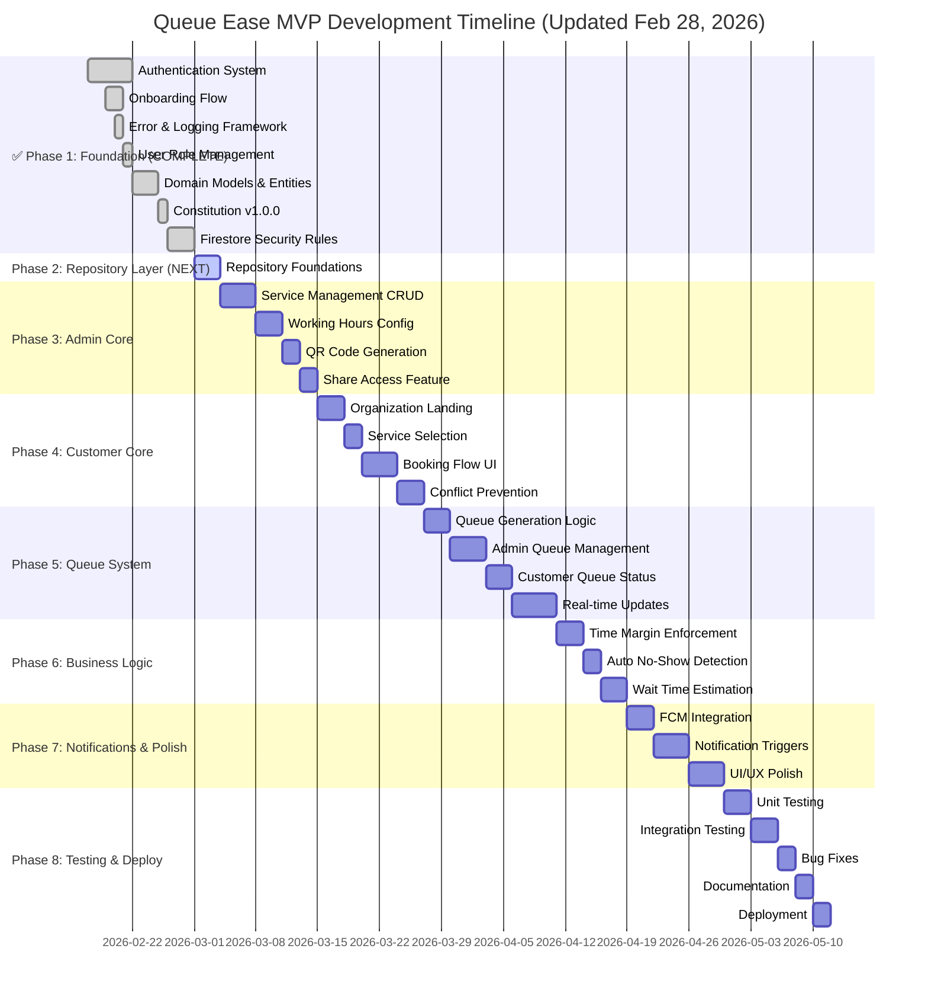
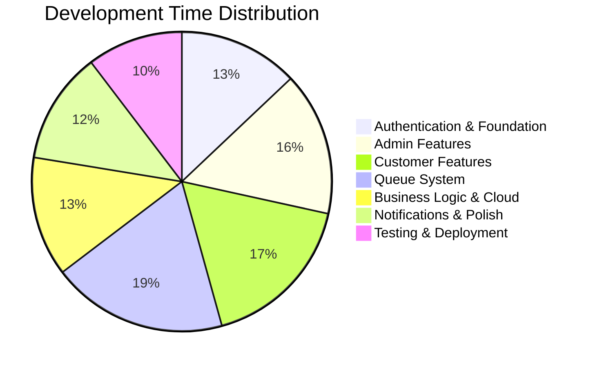

# Queue Ease - Project Timeline & Network Diagrams

**Last Updated:** March 8, 2026  
**Project:** Appointment & Queue Manager (Queue Ease)  
**Timeline:** ~11-13 Weeks Remaining (MVP)  
**Current Status:** ✅ Phase 1 Complete + Sprint 2 (Admin Core) Complete  
**Development Approach:** Agile Incremental (Repo + Feature per Sprint)

---

## 📊 Current Progress Summary

**✅ COMPLETED (as of March 8, 2026)**
- **Phase 1: Foundation** - COMPLETE
  - ✅ Authentication System (email/password, Google Sign-In, password reset)
  - ✅ User Role Management (RBAC with router integration)
  - ✅ Error Handling Framework (Result type, AppException hierarchy)
  - ✅ Logging Infrastructure (AppLogger with Talker)
  - ✅ Onboarding Flow (complete with custom illustrations)
  - ✅ Basic Dashboard Pages (Admin & Customer)
  - ✅ Firebase Crashlytics integration with Talker
  - ✅ Flavor configuration (dev/prod environments with dotenv)
- **Data Models** - COMPLETE
  - ✅ All 5 core domain entities (Organization, Service, WorkingHours, Appointment, Queue)
  - ✅ All 5 Firestore models with Firestore serialization (fromFirestore, toFirestore)
  - ✅ 15+ unit tests for entities and models
  - ✅ Constitution v1.0.0 ratified with development standards
- **Firestore Security Rules** - COMPLETE
  - ✅ Comprehensive RBAC security rules (345 lines) covering all 6 collections
  - ✅ 78 TypeScript tests passing (users, organizations, services, working_hours, appointments, queues)
  - ✅ Deployed to both dev & prod Firebase environments
  - ✅ Data validation, field immutability, and cross-org access prevention
- **Sprint 2: Admin Core** - COMPLETE
  - ✅ Organization creation during admin signup
  - ✅ OrganizationRepository with real-time streams
  - ✅ Organization profile view and edit screens
  - ✅ ServiceRepository with CRUD operations
  - ✅ Service management UI (list, add, edit, delete)
  - ✅ Service validation and time margin configuration
  - ✅ First-time setup tutorial for new admins
  - ✅ User document updated with organizationId reference

**⏳ PENDING (Agile Incremental Approach)**
- Sprint 3 (Week 4): Working Hours + QR/Share - Repo to UI (next up)
- Sprint 4 (Weeks 5-6): Customer Booking Flow - Repos to UI
- Sprint 5 (Weeks 7-8): Queue System - Repo to UI
- Sprint 6 (Weeks 9-10): Business Logic & Cloud Functions
- Sprint 7 (Weeks 11-12): Notifications & Polish
- Sprint 8 (Weeks 13-14): Testing & Deployment

**Note:** Each sprint delivers a complete, demoable feature (repository + business logic + UI + tests).

---

## 📅 Updated Gantt Chart - MVP Timeline

```mermaid
gantt
    title Queue Ease MVP Development Timeline (Updated Feb 28, 2026)
    dateFormat YYYY-MM-DD
    section ✅ Phase 1: Foundation (COMPLETE)
    Authentication System           :done, p1a, 2026-02-17, 5d
    Onboarding Flow                :done, p1a2, 2026-02-19, 2d
    Error & Logging Framework      :done, p1a3, 2026-02-20, 1d
    User Role Management           :done, p1d, 2026-02-21, 1d
    Domain Models & Entities       :done, p1e, 2026-02-22, 3d
    Constitution v1.0.0            :done, p1f, 2026-02-25, 1d
    Firestore Security Rules       :done, p1c, 2026-02-26, 3d

    section Phase 2: Repository Layer (NEXT)
    Repository Foundations         :active, p2a, 2026-03-01, 3d

    section Phase 3: Admin Core
    Service Management CRUD        :p3a, 2026-03-04, 4d
    Working Hours Config           :p3b, 2026-03-08, 3d
    QR Code Generation             :p3c, 2026-03-11, 2d
    Share Access Feature           :p3d, 2026-03-13, 2d

    section Phase 4: Customer Core
    Organization Landing           :p4a, 2026-03-15, 3d
    Service Selection              :p4b, 2026-03-18, 2d
    Booking Flow UI                :p4c, 2026-03-20, 4d
    Conflict Prevention            :p4d, 2026-03-24, 3d

    section Phase 5: Queue System
    Queue Generation Logic         :p5a, 2026-03-27, 3d
    Admin Queue Management         :p5b, 2026-03-30, 4d
    Customer Queue Status          :p5c, 2026-04-03, 3d
    Real-time Updates              :p5d, 2026-04-06, 5d

    section Phase 6: Business Logic
    Time Margin Enforcement        :p6a, 2026-04-11, 3d
    Auto No-Show Detection         :p6b, 2026-04-14, 2d
    Wait Time Estimation           :p6c, 2026-04-16, 3d

    section Phase 7: Notifications & Polish
    FCM Integration                :p7a, 2026-04-19, 3d
    Notification Triggers          :p7b, 2026-04-22, 4d
    UI/UX Polish                   :p7c, 2026-04-26, 4d

    section Phase 8: Testing & Deploy
    Unit Testing                   :p8a, 2026-04-30, 3d
    Integration Testing            :p8b, 2026-05-03, 3d
    Bug Fixes                      :p8c, 2026-05-06, 2d
    Documentation                  :p8d, 2026-05-08, 2d
    Deployment                     :p8e, 2026-05-10, 2d
```

---

## 🚀 Sprint Planning (2-week sprints)

### ✅ Sprint 1 (Weeks 1-3): Foundation + Data Layer - COMPLETE
**Goal:** Complete authentication and database foundation

**Sprint Status:** ✅ COMPLETE

**Sprint Backlog:**
- ✅ Authentication system (COMPLETE)
- ✅ User role management (COMPLETE)
- ✅ Onboarding flow (COMPLETE)
- ✅ Error handling & logging (COMPLETE)
- ✅ Firestore data models — all 5 entities & 5 models (COMPLETE)
- ✅ Security rules — 78 tests, deployed to dev & prod (COMPLETE)

**Completed Items:**
- ✅ Email/password and Google Sign-In fully functional
- ✅ Role-based access control implemented
- ✅ Auth state persistence working
- ✅ Comprehensive auth UI with all widgets
- ✅ Password reset functionality
- ✅ AuthCubit with complete test coverage
- ✅ Clean architecture established
- ✅ All 5 Firestore entity classes and Firestore models
- ✅ 15+ unit tests for entities and models
- ✅ Firestore Security Rules (345 lines) covering users, organizations, services, working_hours, appointments, queues
- ✅ 78 TypeScript security rule tests passing
- ✅ Rules deployed to both dev and prod Firebase environments

---

### ✅ Sprint 2 (Week 3): Organization Setup + Service Management - COMPLETE
**Goal:** Enable organization creation during signup, then complete service management

**Sprint Status:** ✅ COMPLETE (March 8, 2026)

**Sprint Backlog:**
**Part 1: Organization Setup (2-3 days)**
- ✅ OrganizationRepository implementation (CRUD + real-time stream)
- ✅ Modify signup flow to create Organization document
- ✅ Update user document to include organizationId reference
- ✅ Organization profile view screen (admin UI)
- ✅ Organization profile edit functionality (admin UI)
- ✅ Organization repository unit tests
- ✅ First-time setup tutorial implementation

**Part 2: Service Management (3-4 days)**
- ✅ ServiceRepository implementation (CRUD + real-time stream)
- ✅ Service repository unit tests
- ✅ Service list screen (admin UI)
- ✅ Add/edit service forms (admin UI)
- ✅ Service validation logic
- ✅ Time margin configuration UI
- ✅ Service active/inactive toggle

**Definition of Done:**
- ✅ OrganizationRepository fully implemented and tested
- ✅ Admin signup creates Organization document in Firestore
- ✅ User document has organizationId field linking to their organization
- ✅ Admin can view and edit their organization profile
- ✅ ServiceRepository fully implemented and tested
- ✅ Admin can view all services for their organization
- ✅ Admin can create new services (with organizationId reference)
- ✅ Admin can edit existing services
- ✅ Admin can delete services
- ✅ Time margin can be configured per service
- ✅ First-time setup tutorial guides new admins through setup
- ✅ Complete flow demoable: Signup → Organization created → Services managed

---

### Sprint 3 (Week 4): Working Hours + QR/Share
**Goal:** Complete working hours configuration and organization sharing

**Sprint Backlog:**
- WorkingHoursRepository implementation (CRUD + stream)
- Working Hours repository unit tests
- Working hours configuration screen (admin UI)
- Daily schedule setup UI
- Break time configuration UI
- Schedule validation logic
- QR code generation functionality
- Unique link generation for organization
- QR display screen (admin UI)
- Native share integration

**Definition of Done:**
- WorkingHoursRepository fully implemented and tested
- Admin can configure working hours per day
- Admin can set break times
- Working hours validation prevents invalid schedules
- Admin can generate QR code for their organization
- Admin can share organization link
- QR code can be scanned to access organization
- All code tested
- Feature demoable end-to-end

---

### Sprint 4 (Weeks 5-6): Customer Booking Flow
**Goal:** Enable customers to discover and book appointments

**Sprint Backlog:**
- OrganizationRepository implementation (CRUD + stream)
- AppointmentRepository implementation (CRUD + stream)
- Repository unit tests (Organization + Appointment)
- Organization landing screen (customer UI)
- Service selection screen (customer UI)
- Time slot calculation logic
- Time slot picker UI (customer UI)
- Booking form (customer UI)
- Conflict detection logic
- Booking confirmation screen (customer UI)
- Deep linking support (QR → Organization)

**Definition of Done:**
- OrganizationRepository and AppointmentRepository fully implemented and tested
- Customers can access organization via QR/link
- Customers can view organization info and status (open/closed)
- Customers can browse available services
- Customers can see available time slots based on working hours
- Customers can select a time and book an appointment
- Double bookings are prevented (conflict detection)
- Booking confirmation is shown
- Appointments are saved to Firestore
- All code tested
- Complete booking flow demoable end-to-end

### Sprint 5 (Weeks 7-8): Queue System
**Goal:** Implement complete queue management for admin and customer

**Sprint Backlog:**
- QueueRepository implementation (CRUD + stream)
- Queue repository unit tests
- Queue generation logic (from appointments)
- Admin queue management screen
- Queue action buttons (Next, Skip, No-Show)
- Customer queue status screen
- Queue position calculation
- Wait time estimation logic
- Real-time Firestore listeners
- Real-time update propagation

**Definition of Done:**
- QueueRepository fully implemented and tested
- Daily queue auto-generates from appointments
- Admin can view queue for current day
- Admin can advance queue (mark current customer served)
- Admin can skip customers
- Admin can mark no-shows
- Customers can view their queue status
- Customers see their position in queue
- Customers see estimated wait time
- Updates propagate in real-time to all clients
- Edge cases handled (empty queue, no appointments, etc.)
- All code tested
- Complete queue flow demoable end-to-end

---

### Sprint 6 (Weeks 9-10): Business Logic & Automation
**Goal:** Implement time margin policy and automated no-show detection

**Sprint Backlog:**
- Time margin countdown UI/logic
- Client-side timer implementation
- Cloud Functions setup (Firebase Functions)
- Auto no-show detection Cloud Function
- Firestore trigger configuration
- Automatic status update logic
- Queue advancement automation
- Server-side validation rules
- Cloud Function deployment (dev + prod)
- Time margin scenario testing

**Definition of Done:**
- Time margin policy enforced on client
- Countdown timer shows remaining time before no-show
- Cloud Functions deployed and operational
- No-shows detected automatically server-side
- Queue advances automatically when no-show detected
- Appointment status updates automatically
- Business rules validated server-side
- All scenarios tested (on-time, late, no-show)
- Cloud Functions monitored and logging properly

---

### Sprint 7 (Weeks 11-12): Notifications & Polish
**Goal:** Complete notifications and polish the entire app UI/UX

**Sprint Backlog:**
- FCM setup in Firebase Console
- FCM configuration in Flutter app
- FCM token management
- Notification Cloud Functions
- Notification triggers (turn approaching, your turn, missed turn, etc.)
- In-app notification UI
- Push notification testing
- UI/UX polish across all screens
- Loading states and indicators
- Error state handling
- Empty state UI
- Animations and transitions
- Accessibility improvements
- Responsive design validation

**Definition of Done:**
- FCM fully integrated and configured
- Notifications sent for all key events
- Push notifications delivered reliably
- In-app notifications displayed properly
- UI is polished and consistent across app
- All screens have proper loading states
- Error states handled gracefully
- Empty states are user-friendly
- Animations are smooth and purposeful
- App is responsive on different screen sizes
- Accessibility validated
- App feels production-ready

---

### Sprint 8 (Weeks 13-14): Testing & Deployment
**Goal:** Comprehensive testing, bug fixes, and MVP deployment

**Sprint Backlog:**
- Unit test expansion (all repositories, business logic)
- Widget test creation (key screens and flows)
- Integration test development (end-to-end flows)
- Manual testing across devices
- Bug identification and fixing
- Performance profiling and optimization
- API documentation
- User guide creation
- README updates
- Release build preparation
- Internal testing deployment
- Production deployment checklist

**Definition of Done:**
- Unit test coverage ≥ 80%
- Widget test coverage ≥ 70%
- Integration tests cover critical paths
- All critical bugs fixed
- All high-priority bugs fixed
- Performance is acceptable (no ANR, smooth scrolling)
- Documentation complete and accurate
- User guides written
- Release builds created (Android APK/AAB)
- App deployed to internal testing
- Production deployment ready
- MVP fully functional and demoable

---

## 📈 Resource Allocation

```mermaid
pie title Development Time Distribution
    "Authentication & Foundation" : 15
    "Admin Features" : 18
    "Customer Features" : 20
    "Queue System" : 22
    "Business Logic & Cloud" : 15
    "Notifications & Polish" : 14
    "Testing & Deployment" : 12
```

---

## ⚠️ Risk Management

### High Priority Risks

| Risk | Impact | Probability | Mitigation |
|------|--------|-------------|------------|
| Real-time sync issues | High | Medium | Early prototyping of Firestore listeners |
| Race conditions in queue | High | High | Server-side validation via Cloud Functions |
| Notification delivery failures | Medium | Medium | Retry logic and error handling |
| Time estimation accuracy | Medium | High | Conservative estimates with buffer |
| Authentication security breaches | High | Low | Follow Firebase best practices |

### Timeline Risks

| Risk | Impact | Mitigation |
|------|--------|------------|
| Feature scope creep | +2 weeks | Strict adherence to MVP scope |
| Firebase quota limits | +1 week | Monitor usage, upgrade if needed |
| Testing reveals major bugs | +1 week | Continuous testing throughout |
| Integration complexity | +1 week | Early integration of systems |

---

## 🎯 Milestone Checklist

- [x] **Milestone 1 (Week 2):** ✅ Authentication complete (email/password, Google Sign-In, RBAC)
- [x] **Milestone 2 (Week 3):** ✅ Data models (5 entities, 5 Firestore models) and security rules (78 tests, deployed dev & prod) complete
- [ ] **Milestone 3 (Week 3):** Organization setup complete; Admin can manage services (end-to-end feature complete)
- [ ] **Milestone 4 (Week 4):** Admin can configure working hours and share organization via QR
- [ ] **Milestone 5 (Weeks 5-6):** Customers can book appointments (end-to-end booking flow)
- [ ] **Milestone 6 (Weeks 7-8):** Queue system operational with real-time updates
- [ ] **Milestone 7 (Weeks 9-10):** Time margin and automation working with Cloud Functions
- [ ] **Milestone 8 (Weeks 11-12):** Notifications functional, UI polished
- [ ] **Milestone 9 (Weeks 13-14):** MVP fully tested and deployed

---

## 📊 Overall Progress Summary (as of February 28, 2026)

### Completed Work
- ✅ **Authentication System** - Fully functional with email/password and Google Sign-In
- ✅ **Role-Based Access Control** - Admin and customer roles with route protection
- ✅ **Onboarding Flow** - Complete with custom illustrations and persistence
- ✅ **Error Handling Framework** - Result type and AppException hierarchy
- ✅ **Logging Infrastructure** - AppLogger with Talker + Crashlytics, environment-based verbosity
- ✅ **Clean Architecture** - Established patterns with DI (GetIt/injectable) and state management
- ✅ **Auth Testing** - AuthCubit fully tested, 15+ entity/model tests passing
- ✅ **Basic Dashboard Pages** - Admin and Customer placeholder pages
- ✅ **Domain Entities** - All 5 entities (Organization, Service, WorkingHours, Appointment, Queue)
- ✅ **Firestore Models** - All 5 models with full Firestore serialization (fromFirestore / toFirestore)
- ✅ **Firestore Security Rules** - 345 lines of RBAC rules, 78 TypeScript tests passing, deployed to dev & prod
- ✅ **Flavor Config** - Dev and prod environments with dotenv support

### Current Status
- **Overall Progress:** ~20% complete (Foundation + Data Layer done)
- **Phase 1 (Foundation):** ✅ COMPLETE
- **Data Models:** ✅ COMPLETE
- **Security Rules:** ✅ COMPLETE
- **Current Sprint:** Sprint 2 - Service Management (Repo to UI)
- **Current Branch:** `001-firestore-security-rules` (to be merged to `develop`)
- **Development Approach:** Agile Incremental Delivery
- **Estimated Completion:** 12-14 weeks remaining (~8 sprints)

### Next Immediate Tasks (Sprint 2 - Week 3)
**Part 1: Organization Setup (Days 1-3)**
1. Implement OrganizationRepository (CRUD + stream)
2. Modify signup to create Organization doc in Firestore
3. Update UserEntity to include organizationId field
4. Update FirestoreUserDatasource to handle organizationId
5. Build Organization profile view screen
6. Build Organization profile edit screen
7. Write OrganizationRepository unit tests
8. Integration test for signup → organization creation

**Part 2: Service Management (Days 4-7)**
9. Implement ServiceRepository (CRUD + stream, with organizationId)
10. Write ServiceRepository unit tests
11. Build Service list screen (admin UI)
12. Build Add/Edit service forms (admin UI)
13. Implement service validation logic
14. Add time margin configuration UI
15. Write widget tests for service screens
16. Integration test for complete service management flow

**Deliverables:** 
- Admin signup creates Organization document
- Admin can manage their organization profile  
- Admin can fully manage services linked to their organization

---

**Completed Sprints:**
1. ✅ Sprint 1: Authentication + Data Models + Security Rules — COMPLETE

**Current Sprint:**
2. ⏳ Sprint 2: Service Management (Repo to UI) — IN PROGRESS
4. ⏳ Implement repository layer (Sprint 2)
5. ⏳ Begin Admin Core feature UI

**For Updates:**
- [Feature Checklist](FEATURE_CHECKLIST.md) - ✅ Updated February 28, 2026
- [PRD](PRD.md) - Product Requirements Document
