# Queue Ease - Project Timeline & Network Diagrams

**Last Updated:** February 21, 2026  
**Project:** Appointment & Queue Manager (Queue Ease)  
**Timeline:** 6-7 Weeks Remaining (MVP)  
**Current Status:** ✅ Phase 1 Complete (Authentication & Foundation)

---

## 📊 Current Progress Summary

**✅ COMPLETED (as of February 21, 2026)**
- **Phase 1: Foundation** - COMPLETE
  - ✅ Authentication System (email/password, Google Sign-In, password reset)
  - ✅ User Role Management (RBAC with router integration)
  - ✅ Error Handling Framework (Result type, AppException hierarchy)
  - ✅ Logging Infrastructure (AppLogger with Talker)
  - ✅ Onboarding Flow (complete with custom illustrations)
  - ✅ Basic Dashboard Pages (Admin & Customer)

**🚧 IN PROGRESS**
- Currently on `feature/auth` branch

**⏳ PENDING**
- Phase 2: Data Layer & Admin Core
- Phase 3: Customer Booking
- Phase 4: Queue System
- Phase 5: Business Logic
- Phase 6: Notifications & Polish
- Phase 7: Testing & Deployment

---

## 📅 Updated Gantt Chart - MVP Timeline

---

## 🔗 Dependency Network Diagram

---

## 🎯 Critical Path Analysis

```mermaid
graph LR
    A[✅ Start] --> B[✅ Auth System<br/>5 days]
    B --> C[Firestore Models<br/>4 days]
    C --> D[Security Rules<br/>3 days]
    D --> E[Service Mgmt<br/>4 days]
    E --> F[Working Hours<br/>3 days]
    F --> G[Booking Flow<br/>4 days]
    G --> H[Conflict Prevention<br/>3 days]
    H --> I[Queue Generation<br/>3 days]
    I --> J[Admin Queue Mgmt<br/>4 days]
    J --> K[Real-time Updates<br/>5 days]
    K --> L[Time Margin Logic<br/>3 days]
    L --> M[Cloud Functions<br/>3 days]
    M --> N[FCM Integration<br/>3 days]
    N --> O[Notifications<br/>4 days]
    O --> P[Testing<br/>6 days]
    P --> Q[Deployment<br/>2 days]
    Q --> R[End]
    
    style A fill:#90EE90
    style B fill:#90EE90
    style R fill:#FF6B6B
    style C fill:#FFD700
    style D fill:#FFD700
    style E fill:#FFD700
    style F fill:#FFD700
    style G fill:#FFD700
    style H fill:#FFD700
    style I fill:#FFD700
    style J fill:#FFD700
    style K fill:#FFD700
    style L fill:#FFD700
    style M fill:#FFD700
    style N fill:#FFD700
    style O fill:#FFD700
    style P fill:#FFD700
    style Q fill:#FFD700
```

**Critical Path Duration:** ~47 days (~6-7 weeks remaining)  
**Completed:** Authentication System (5 days)  
**Buffer Time:** 3-4 days built into estimates

---

## 📊 Work Breakdown Structure (WBS)

---

## 🔄 Feature Dependency Matrix

---

## 📋 Detailed Work Packages

### ✅ COMPLETED: Week 1-2: Foundation

#### ✅ Package 1.1: Authentication & User Management (COMPLETE)
**Status:** ✅ COMPLETE  
**Completed:** February 21, 2026  
**Deliverables:**
- ✅ Email/password authentication
- ✅ Google Sign-In
- ✅ User role assignment (AuthRoleSelector)
- ✅ Auth state persistence (UserSessionService)
- ✅ Role-based routing (admin=/a/, customer=/c/)
- ✅ Password reset functionality
- ✅ Comprehensive auth UI (login, signup, forgot password)
- ✅ Auth tests (AuthCubit fully tested)

**Implementation Details:**
- AuthRepository with FirebaseAuthDatasource and FirestoreUserDatasource
- AuthCubit with 6 states (Initial, Loading, Authenticated, Unauthenticated, Failure, PasswordResetEmailSent)
- Complete widget library (AuthTextField, PasswordField, GoogleSignInButton, AuthRoleSelector, etc.)
- Error handling with AppException hierarchy
- Logging with AppLogger and Talker
- Clean architecture with dependency injection

---

### 🚧 IN PROGRESS: Week 2-3: Data Layer

#### Package 1.2: Database Foundation (5 days)
**Dependencies:** ✅ Package 1.1 Complete  
**Status:** ⏳ NOT STARTED  
**Deliverables:**
- Firestore collection schemas
- Security rules
- Data models/entities
- Repository interfaces

**Tasks:**
1. Define Firestore collections structure
2. Create entity classes (Organization, Service, Appointment, Queue, etc.)
3. Write Firestore security rules
4. Deploy security rules
5. Create base repository classes
6. Test CRUD operations

---

### Week 3-4: Admin Core Features

#### Package 2.1: Service Management (4 days)
**Dependencies:** Package 1.1, 1.2  
**Deliverables:**
- Service CRUD UI
- Service repository
- Service validation logic

**Tasks:**
1. Create Service entity and model
2. Build ServiceRepository
3. Implement service list screen
4. Create add/edit service forms
5. Add time margin configuration
6. Test service operations

#### Package 2.2: Working Hours Configuration (3 days)
**Dependencies:** Package 2.1  
**Deliverables:**
- Working hours setup UI
- Working hours repository
- Schedule validation

**Tasks:**
1. Create WorkingHours entity
2. Build working hours configuration screen
3. Implement daily schedule setup
4. Add break time configuration
5. Test working hours logic

#### Package 2.3: QR Code & Access Sharing (2 days)
**Dependencies:** Package 1.1  
**Deliverables:**
- QR code generation
- Unique link generation
- Share functionality

**Tasks:**
1. Generate organization-specific links
2. Create QR code from links
3. Build QR display screen
4. Implement native share
5. Test QR scanning flow

---

### Week 3-4: Customer Booking Experience

#### Package 3.1: Organization Landing (3 days)
**Dependencies:** Package 1.1, 2.1  
**Deliverables:**
- Organization landing screen
- Service display
- Open/closed status

**Tasks:**
1. Create OrganizationRepository
2. Build landing screen UI
3. Display available services
4. Show organization status
5. Test deep linking

#### Package 3.2: Booking Flow (7 days)
**Dependencies:** Package 3.1, 2.2  
**Deliverables:**
- Service selection UI
- Time slot picker
- Booking confirmation
- Conflict prevention

**Tasks:**
1. Create Appointment entity
2. Build service selection screen
3. Implement time slot calculation
4. Create time slot picker UI
5. Build booking form
6. Implement conflict detection logic
7. Create confirmation screen
8. Test booking flows

---

### Week 4-5: Queue System Core

#### Package 4.1: Queue Generation & Management (10 days)
**Dependencies:** Package 3.2  
**Deliverables:**
- Daily queue generation
- Admin queue interface
- Customer queue status
- Real-time updates

**Tasks:**
1. Create Queue and QueueEntry entities
2. Implement queue generation logic
3. Build admin queue management screen
4. Add queue action buttons (Next, Skip, No-Show)
5. Create customer queue status screen
6. Implement position calculation
7. Add wait time estimation
8. Set up Firestore listeners
9. Test real-time propagation
10. Handle edge cases

---

### Week 5-6: Business Logic & Cloud Functions

#### Package 5.1: Time Margin & Auto No-Show (8 days)
**Dependencies:** Package 4.1  
**Deliverables:**
- Time margin enforcement
- Auto no-show detection
- Cloud Functions for server logic

**Tasks:**
1. Design time margin countdown logic
2. Implement client-side timer
3. Create Cloud Function for no-show detection
4. Set up Firestore triggers
5. Implement automatic status updates
6. Add queue advancement logic
7. Test margin scenarios
8. Deploy Cloud Functions

---

### Week 6-7: Notifications & Polish

#### Package 6.1: Push Notifications (7 days)
**Dependencies:** Package 5.1  
**Deliverables:**
- FCM integration
- Notification triggers
- In-app notifications

**Tasks:**
1. Set up FCM in Firebase Console
2. Configure FCM in Flutter app
3. Implement token management
4. Create notification Cloud Functions
5. Add notification triggers (turn approaching, missed, etc.)
6. Build in-app notification UI
7. Test notification delivery

#### Package 6.2: UI/UX Polish (4 days)
**Dependencies:** All previous packages  
**Deliverables:**
- Polished UI across all screens
- Loading states
- Error handling
- Animations

**Tasks:**
1. Add loading indicators
2. Implement error states
3. Add empty states
4. Polish animations and transitions
5. Test accessibility
6. Responsive design adjustments

---

### Week 7-8: Testing & Deployment

#### Package 7.1: Testing (7 days)
**Dependencies:** All previous packages  
**Deliverables:**
- Comprehensive test suite
- Bug fixes
- Performance optimization

**Tasks:**
1. Write unit tests for repositories
2. Write unit tests for business logic
3. Create widget tests for key screens
4. Build integration tests for flows
5. Perform manual testing
6. Fix identified bugs
7. Performance profiling

#### Package 7.2: Documentation & Deployment (3 days)
**Dependencies:** Package 7.1  
**Deliverables:**
- Complete documentation
- Deployed MVP

**Tasks:**
1. Write API documentation
2. Create user guides
3. Update README
4. Prepare release builds
5. Deploy to internal testing
6. Create deployment checklist

---

## 🚀 Sprint Planning (2-week sprints)

### ✅ Sprint 1 (Weeks 1-2): Foundation - PARTIALLY COMPLETE
**Goal:** Complete authentication and database foundation

**Sprint Status:** 🔄 50% Complete (Auth done, data models pending)

**Sprint Backlog:**
- ✅ Authentication system (COMPLETE)
- ✅ User role management (COMPLETE)
- ✅ Onboarding flow (COMPLETE)
- ✅ Error handling & logging (COMPLETE)
- ⏳ Firestore data models (PENDING)
- ⏳ Security rules (PENDING)
- ⏳ Service management CRUD (PENDING - moved to Sprint 2)
- ⏳ Working hours configuration (PENDING - moved to Sprint 2)

**Completed Items:**
- ✅ Email/password and Google Sign-In fully functional
- ✅ Role-based access control implemented
- ✅ Auth state persistence working
- ✅ Comprehensive auth UI with all widgets
- ✅ Password reset functionality
- ✅ AuthCubit with complete test coverage
- ✅ Clean architecture established

**Remaining Tasks:**
- Define all Firestore entity models
- Write and deploy security rules
- Create repository base classes

---

### Sprint 2 (Weeks 3-4): Admin Features & Data Layer
**Goal:** Complete data layer and enable admin service management

**Sprint Backlog:**
- Firestore data models (Organization, Service, WorkingHours, Appointment, Queue)
- Security rules
- Service management CRUD
- Working hours configuration
- QR code generation
- Organization landing screen (basic)

**Definition of Done:**
- All Firestore entity models defined
- Security rules written and deployed
- Admin can create and manage services
- Admin can configure working hours
- Basic organization landing page exists
- All code is tested

---

### Sprint 3 (Weeks 4-5): Customer Booking
**Goal:** Enable customers to book appointments

**Sprint Backlog:**
- QR code generation
- Organization landing screen
- Service selection
- Time slot picker
- Booking flow
- Conflict prevention

**Definition of Done:**
- Customers can access via QR/link
- Customers can browse services
- Customers can book appointments
- Double bookings are prevented
- Bookings are saved to Firestore

---

### Sprint 3 (Weeks 4-5): Customer Booking
**Goal:** Enable customers to book appointments

**Sprint Backlog:**
- QR code generation (if not completed in Sprint 2)
- Organization landing screen (enhanced)
- Service selection
- Time slot picker
- Booking flow
- Conflict prevention

**Definition of Done:**
- Customers can access via QR/link
- Customers can browse services
- Customers can book appointments
- Double bookings are prevented
- Bookings are saved to Firestore

---

### Sprint 4 (Weeks 5-6): Queue System
**Goal:** Implement queue management for both admin and customer

**Sprint Backlog:**
- Queue generation from appointments
- Admin queue management UI
- Queue actions (Next, Skip, No-Show)
- Customer queue status view
- Real-time updates
- Position and wait time calculation

**Definition of Done:**
- Daily queue auto-generates
- Admin can manage queue in real-time
- Customers see their position
- Updates propagate instantly
- Edge cases handled

---

### Sprint 4 (Weeks 5-6): Queue System
**Goal:** Implement queue management for both admin and customer

**Sprint Backlog:**
- Queue generation from appointments
- Admin queue management UI
- Queue actions (Next, Skip, No-Show)
- Customer queue status view
- Real-time updates
- Position and wait time calculation

**Definition of Done:**
- Daily queue auto-generates
- Admin can manage queue in real-time
- Customers see their position
- Updates propagate instantly
- Edge cases handled

---

### Sprint 5 (Weeks 6-7): Business Logic
**Goal:** Implement time margin policy and automation

**Sprint Backlog:**
- Time margin countdown
- Auto no-show detection
- Wait time estimation
- Cloud Functions setup
- Server-side validation

**Definition of Done:**
- Time margin policy enforced
- No-shows detected automatically
- Queue advances automatically
- Cloud Functions deployed
- Business rules validated server-side

---

### Sprint 5 (Weeks 6-7): Business Logic
**Goal:** Implement time margin policy and automation

**Sprint Backlog:**
- Time margin countdown
- Auto no-show detection
- Wait time estimation
- Cloud Functions setup
- Server-side validation

**Definition of Done:**
- Time margin policy enforced
- No-shows detected automatically
- Queue advances automatically
- Cloud Functions deployed
- Business rules validated server-side

---

### Sprint 6 (Weeks 7-8): Notifications & Polish
**Goal:** Complete notifications and polish the UI

**Sprint Backlog:**
- FCM integration
- Notification triggers
- Push notification delivery
- UI/UX polish
- Error handling
- Animations

**Definition of Done:**
- Notifications sent for key events
- UI is polished and consistent
- Error states handled gracefully
- App is responsive
- Accessibility validated

---

### Sprint 6 (Weeks 7-8): Notifications & Polish
**Goal:** Complete notifications and polish the UI

**Sprint Backlog:**
- FCM integration
- Notification triggers
- Push notification delivery
- UI/UX polish
- Error handling
- Animations

**Definition of Done:**
- Notifications sent for key events
- UI is polished and consistent
- Error states handled gracefully
- App is responsive
- Accessibility validated

---

### Sprint 7 (Weeks 8-9): Testing & Launch
**Goal:** Comprehensive testing and MVP deployment

**Sprint Backlog:**
- Unit testing
- Widget testing
- Integration testing
- Bug fixes
- Documentation
- Deployment

**Definition of Done:**
- Test coverage > 70%
- All critical bugs fixed
- Documentation complete
- App deployed to testing environment
- MVP ready for demo

---

## 📈 Resource Allocation

---

## ⚠️ Risk Management

### High Priority Risks

| Risk | Impact | Probability | Mitigation |
|------|--------|-------------|------------|
| Real-time sync issues | High | Medium | Early prototyping of Firestore listeners |
| Race conditions in queue | High | High | Server-side validation via Cloud Functions |
| Notification delivery failures | Medium | Medium | Retry logic and error handling |
| Time estimation accuracy | Medium | High | Conservative estimates with buffer |
| Authentication security breaches | High | Low | Follow Firebase best practices |

### Timeline Risks

| Risk | Impact | Mitigation |
|------|--------|------------|
| Feature scope creep | +2 weeks | Strict adherence to MVP scope |
| Firebase quota limits | +1 week | Monitor usage, upgrade if needed |
| Testing reveals major bugs | +1 week | Continuous testing throughout |
| Integration complexity | +1 week | Early integration of systems |

---

## 🎯 Milestone Checklist

- [x] **Milestone 1 (Week 2):** ✅ Authentication complete (email/password, Google Sign-In, RBAC)
- [ ] **Milestone 2 (Week 3):** Data models and security rules deployed
- [ ] **Milestone 3 (Week 4):** Services and working hours manageable by admin
- [ ] **Milestone 4 (Week 5):** Customers can book appointments
- [ ] **Milestone 5 (Week 6):** Queue system operational with real-time updates
- [ ] **Milestone 6 (Week 7):** Time margin and automation working
- [ ] **Milestone 7 (Week 8):** Notifications functional, UI polished
- [ ] **Milestone 8 (Week 9):** MVP tested and deployed

---

## 📊 Progress Tracking

### Weekly KPIs
- Features completed vs. planned
- Test coverage percentage
- Open bugs count
- Code review completion rate
- Documentation progress

### Success Metrics
- All MVP features functional
- < 5 critical bugs remaining
- Test coverage > 70%
- Positive internal demo feedback
- Deployable to production

---

## 📊 Overall Progress Summary (as of February 21, 2026)

### Completed Work
- ✅ **Authentication System** - Fully functional with email/password and Google Sign-In
- ✅ **Role-Based Access Control** - Admin and customer roles with route protection
- ✅ **Onboarding Flow** - Complete with custom illustrations and persistence
- ✅ **Error Handling Framework** - Result type and AppException hierarchy
- ✅ **Logging Infrastructure** - AppLogger with environment-based verbosity
- ✅ **Clean Architecture** - Established patterns with DI and state management
- ✅ **Auth Testing** - AuthCubit fully tested with comprehensive coverage
- ✅ **Basic Dashboard Pages** - Admin and Customer placeholder pages

### Current Status
- **Overall Progress:** ~25-30% complete
- **Phase 1:** ✅ COMPLETE
- **Current Branch:** `feature/auth`
- **Estimated Completion:** 6-7 weeks remaining

### Next Immediate Tasks
1. Define all Firestore entity models (Organization, Service, WorkingHours, Appointment, Queue)
2. Write and deploy Firestore security rules
3. Implement Service Management CRUD operations
4. Build Working Hours configuration UI
5. Generate QR codes for organization access

---

**Next Steps:**
1. ✅ Authentication complete - merge to main
2. Create feature branch for data layer
3. Define all Firestore entities
4. Write security rules
5. Begin Sprint 2 (Admin Core Features)

**For Updates:**
- [Feature Checklist](FEATURE_CHECKLIST.md) - ✅ Updated February 21, 2026
- [PRD](PRD.md) - Product Requirements Document
